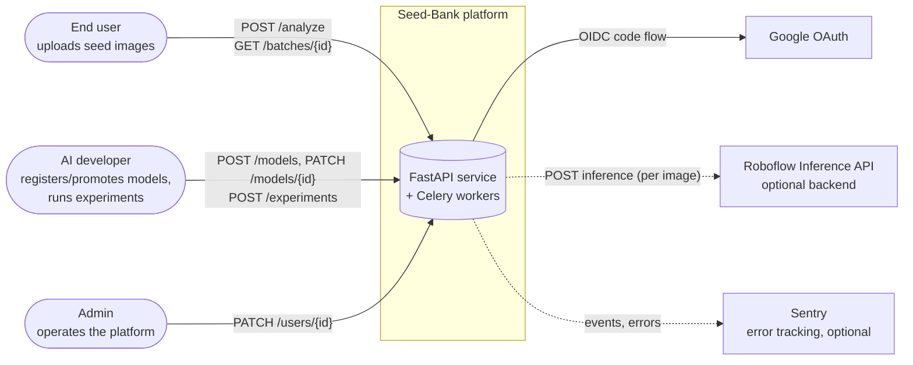

# 01 — System Context

The outermost view: people and external systems that interact with
seed-bank. Useful for onboarding ("what does this thing do, and to
whom?") and for scoping discussions ("is this in or out of our
boundary?").

## Diagram

## Notes

- All three actor classes (`end_user`, `ai_developer`, `admin`) hit the
  same HTTP surface; what changes is the RBAC scope. See
  [08 — Auth sequences](08-auth-sequence.md).
- Roboflow is one of three model backends (`torch_local`, `roboflow`,
  `yolo`). The system functions fully without it; the dashed edge is
  optional.
- Sentry is opt-in via `SENTRY_DSN`. Empty in dev.
- ML training happens *outside* this system — only the resulting
  weights and metrics are imported via `scripts/register_model.py` and
  the `POST /api/v1/models` endpoint.
