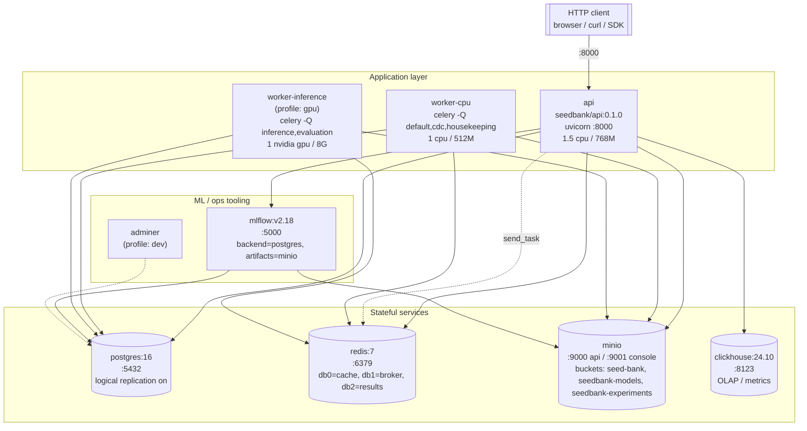

# 02 — Containers (Compose stack)

The runtime topology one level deeper than [system context](01-system-context.md):
each box is a process declared in `compose.yaml`. Healthchecks and
dependencies match the file exactly.

## Diagram

## What runs where

| Service | Image | Purpose | Healthcheck |
|---|---|---|---|
| `api` | `seedbank/api:0.1.0` (target `runtime-cpu`) | FastAPI HTTP surface, all routers under `/api/v1` | `GET /readyz` |
| `worker-cpu` | `seedbank/worker-cpu:0.1.0` | Celery worker for default/cdc/housekeeping queues. CPU-only model paths and bookkeeping tasks. | `celery inspect ping` |
| `worker-inference` | `seedbank/worker-inference:0.1.0` (target `runtime-gpu`) | Celery worker for inference + evaluation queues. **`gpu` profile only** — laptops without CUDA bring up everything else. | none in compose |
| `postgres` | `postgres:16-alpine` | OLTP. `wal_level=logical` is on for the future ClickHouse CDC pipeline. | `pg_isready` |
| `redis` | `redis:7-alpine` | Three logical DBs: 0 (cache), 1 (Celery broker), 2 (Celery result backend). 256M LRU cap. | `redis-cli ping` |
| `minio` | `minio:RELEASE.2024-11-07` | Object store. Buckets are seeded by `make seed`. | `/minio/health/live` |
| `clickhouse` | `clickhouse-server:24.10-alpine` | OLAP. Today: served by `GET /api/v1/models/{id}/performance`. Tomorrow: experiment fact rows + per-detection telemetry. | `/ping` |
| `mlflow` | `ghcr.io/mlflow/mlflow:v2.18.0` | Tracking server. Backend = postgres `mlflow` DB; artifacts = MinIO `seedbank-experiments`. | `/health` |
| `adminer` | `adminer:4.8.1` | DB UI for dev. **`dev` profile only.** | none |

## Network and ports

- All services are on the user-defined `seedbank-net` bridge.
- Every host port is bound to `127.0.0.1` (no public exposure on the
  host) — production would put the API behind a real ingress and never
  expose Postgres/Redis/MinIO to the host network.

## Volumes

- `postgres-data` → `/var/lib/postgresql/data`
- `redis-data` → `/data` (AOF on)
- `minio-data` → `/data`
- `clickhouse-data` → `/var/lib/clickhouse`

The four named volumes are the only state. `make down -v` is
destructive; `make down` is safe.
