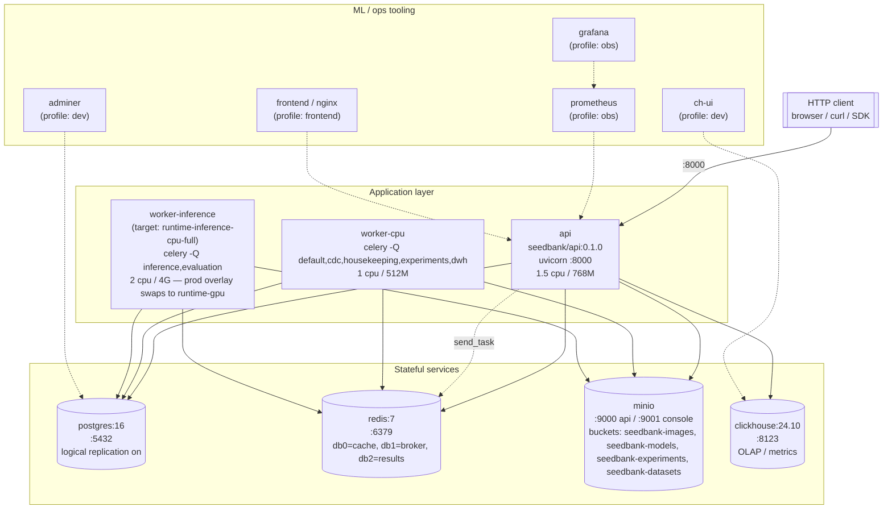

# 02 — Containers (Compose stack)

The runtime topology one level deeper than [system context](01-system-context.md):
each box is a process declared in `compose.yaml`. Healthchecks and
dependencies match the file exactly.

## Diagram

## What runs where

| Service | Image | Purpose | Healthcheck |
|---|---|---|---|
| `api` | `seedbank/api:0.1.0` (target `runtime-cpu`) | FastAPI HTTP surface, all routers under `/api/v1` | `GET /readyz` |
| `worker-cpu` | `seedbank/worker-cpu:0.1.0` | Celery worker for default/cdc/housekeeping/experiments/dwh queues. CPU-only bookkeeping, experiments, and DWH dual-write. | `celery inspect ping` |
| `worker-inference` | `seedbank/worker-inference:0.1.0` (target `runtime-inference-cpu-full` in dev, `runtime-gpu` via the prod overlay) | Celery worker for inference + evaluation queues. Always-on in the default profile; runs CPU torch by default, GPU only under `compose.prod.yaml`. | none in compose |
| `postgres` | `postgres:16-alpine` | OLTP. `wal_level=logical` is on for the future ClickHouse CDC pipeline. | `pg_isready` |
| `redis` | `redis:7-alpine` | Three logical DBs: 0 (cache), 1 (Celery broker), 2 (Celery result backend). 256M LRU cap. | `redis-cli ping` |
| `minio` | `minio:RELEASE.2024-11-07` | Object store. Buckets are seeded by `make seed`. | `/minio/health/live` |
| `clickhouse` | `clickhouse-server:24.10-alpine` | OLAP analytics store. Populated by the app-level DWH dual-write; powers the analytics dashboard (windowed trends). | `/ping` |
| `adminer` | `adminer:4.8.1` | Postgres DB UI. **`dev` profile only.** | none |
| `ch-ui` | `ghcr.io/caioricciuti/ch-ui` | ClickHouse DB UI (`:3488`). **`dev` profile only.** | none |
| `prometheus` | `prom/prometheus` | Scrapes `api:8000/metrics`, 7-day TSDB (`:9090`). **`obs` profile only.** | none |
| `grafana` | `grafana/grafana` | Auto-provisioned dashboards (`:3000`). **`obs` profile only.** | none |
| `frontend` | built React SPA on nginx | Serves the web client on `:5173`. **`frontend` profile only.** | none |

## Network and ports

- All services are on the user-defined `seedbank-net` bridge.
- Every host port is bound to `127.0.0.1` (no public exposure on the
  host) — production would put the API behind a real ingress and never
  expose Postgres/Redis/MinIO to the host network.

## Volumes

- `postgres-data` → `/var/lib/postgresql/data`
- `redis-data` → `/data` (AOF on)
- `minio-data` → `/data`
- `clickhouse-data` → `/var/lib/clickhouse`

The four named volumes are the only state. `make down -v` is
destructive; `make down` is safe.
