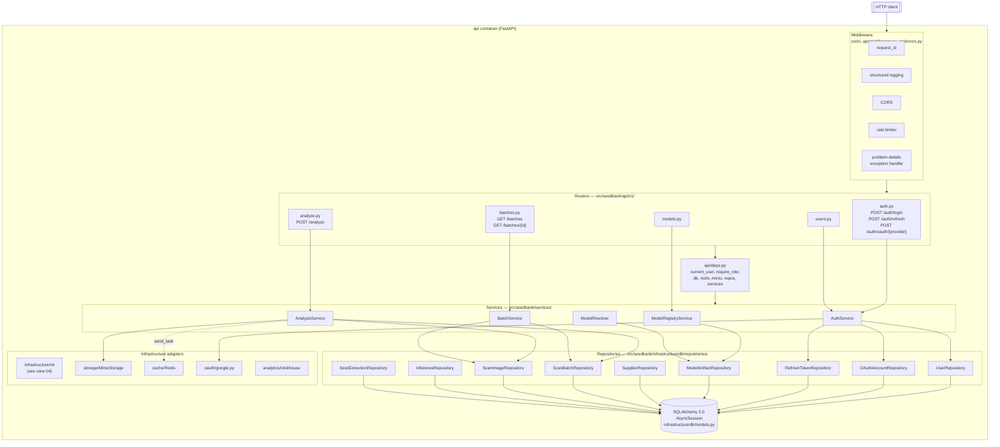

# 03 — API Components

The internal layering of the `api` container. Mirrors pillar 2 of
`CLAUDE.md`: **routers → services → repositories → ORM**, with no
cross-cuts.

## Diagram

## Layering rules (enforced by review, not lint)

1. **Routers** never import SQLAlchemy. They parse request → call a
   service → wrap the result in `Envelope` or `Page` → return.
2. **Services** never import FastAPI. They take primitives (UUIDs,
   bytes, dataclasses) and raise domain exceptions
   (`ValidationError`, `ForbiddenError`, `NotFoundError`,
   `ExternalServiceError`).
3. **Repositories** never embed business rules. One method = one query
   or one persistence intent.
4. **Domain entities** (`src/seedbank/domain/`) are framework-free
   dataclasses. They cannot import SQLAlchemy, FastAPI, or Pydantic.

## Error mapping

`api/errors.py` registers handlers that turn every domain exception
into an RFC 9457 Problem Details response with the right status code:

| Domain exception | HTTP status | `code` field |
|---|---|---|
| `ValidationError` | 422 | `validation_error` |
| `AuthError` | 401 | `auth_error` |
| `ForbiddenError` | 403 | `forbidden` |
| `NotFoundError` | 404 | `not_found` |
| `ConflictError` | 409 | `conflict` |
| `RateLimitError` | 429 | `rate_limited` |
| `ExternalServiceError` | 502/503 | `external_service_error` |

Every response — success or failure — is JSON. No HTML error pages.
