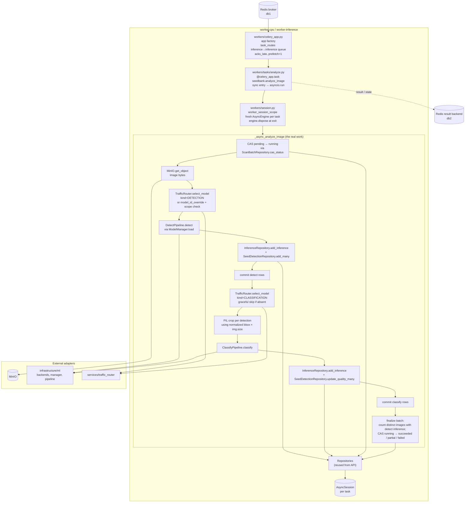

# 04 — Worker Components

Inside the `worker-cpu` / `worker-inference` container. The Celery
process subscribes to queues, picks up a task per image, and runs the
detect → classify → persist pipeline.

## Diagram

## Why a fresh engine per task

Workers cannot reuse the API's process-wide `@lru_cache`'d
`AsyncEngine`. `asyncpg`'s connection pool binds to the event loop it
was created on, and each `asyncio.run(_async_analyze_image(...))`
creates a brand-new loop. Reusing the API's engine would crash with
"got Future <Future pending> attached to a different loop". The
`worker_session_scope()` helper builds and disposes a fresh
`create_async_engine` per task — the precedent is verbatim from
`scripts/register_model.py`.

## Task contract

| Field | Value |
|---|---|
| Name | `seedbank.analyze_image` |
| Args | `(image_id: str, model_id_override: str \| None, seed_type_id: str \| None)` |
| Queue | `inference` (routed via `task_routes`) |
| Retries | `max_retries=2`, `default_retry_delay=10s` |
| `autoretry_for` | `(ExternalServiceError,)` only — never retry on `ValidationError` / `NotFoundError` |
| Acknowledgement | `task_acks_late=True` (worker only acks after success or final failure) |
| Prefetch | `worker_prefetch_multiplier=1` (one inference at a time per worker) |

## Crash-safety invariants

1. The API commits the `scan_batch` + `scan_image` rows **before**
   dispatching to Celery. A worker never sees an orphan task.
2. Detect rows commit before classify runs. If classify fails, detect
   data isn't lost — the batch flips to `partial`, not `failed`.
3. Status flips are CAS (`UPDATE … WHERE status = expected RETURNING
   id`). Two workers racing on the same batch can't both flip it.
4. The PNG/JPEG bytes never live in the DB. Workers fetch from MinIO
   on demand and rely on `seed_detections.box_*_norm` (normalized
   0–1) so the source of truth survives image resizing.
