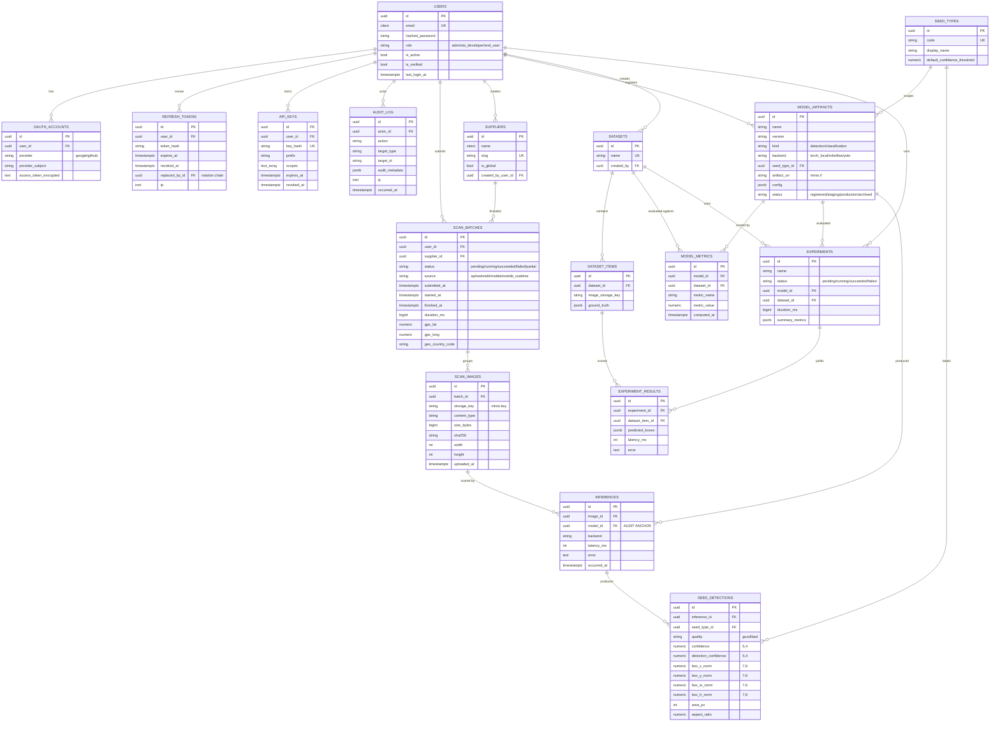

# 05 — Database ERD

The Postgres schema as defined in
`src/seedbank/infrastructure/db/models.py`. Every PK is `uuid7()` from
`core/ids.py`. Soft delete is reserved for user-visible aggregates
(`scan_batches`, `datasets`, `users`); internal tables use hard delete
with `ON DELETE CASCADE`.

## Diagram

## Key invariants

- **Pillar 5 — traceability:** every `seed_detections` row points to
  one `inferences` row, which points to exactly one `model_artifacts`
  row. You can always answer "which model produced this result"
  without joining through audit logs.
- **`uq_inferences_image_model`** — one inference row per `(image_id,
  model_id)`. A re-run with the same model is an update, not a
  duplicate row.
- **`uq_scan_images_batch_storage_key`** — dedup inside a batch via
  the storage key (which embeds the sha256). Re-uploading the same
  bytes in the same batch fails fast.
- **Bounding boxes are normalized 0–1** (`NUMERIC(7,6)`). Pixel
  coordinates are derived at render time, not stored.
- **Confidences are `NUMERIC(5,4)`** — money-style precision. Floats
  would lose the last digit in arithmetic and break the audit trail.
- **`audit_log`** is append-only and indexed by `(actor_id,
  occurred_at)`. Soft deletes don't apply.
