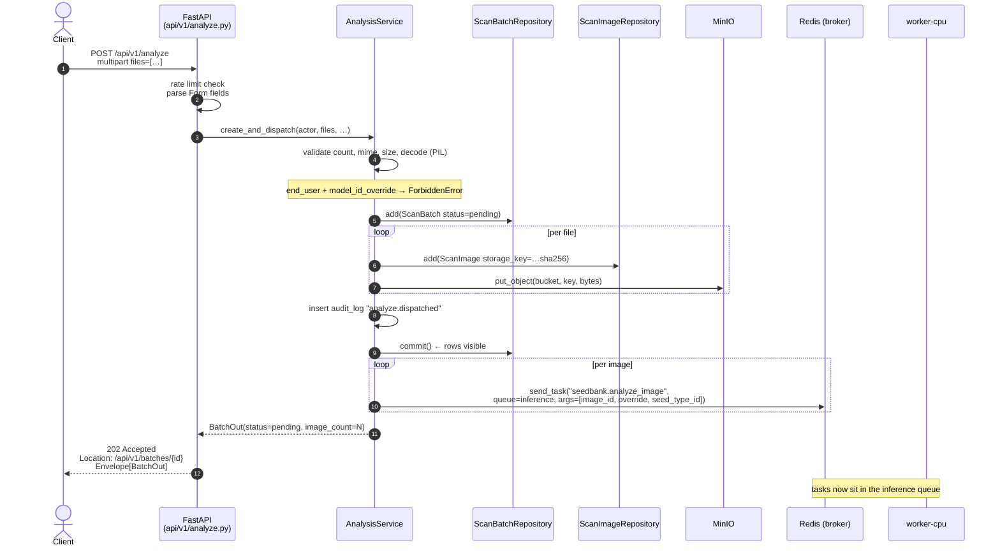
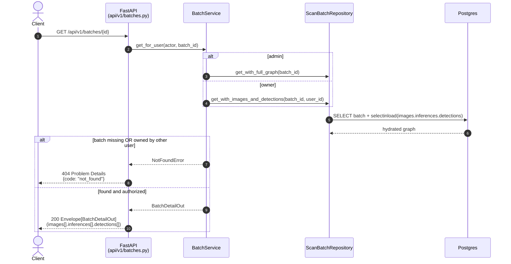

# 06 — Analyze Request Sequence

End-to-end timing for the unified inference path: client uploads N
images, polls until results are available. This is the runtime path
the rest of the platform exists to serve.

## Submission and dispatch



## Worker consumption (per image)

```mermaid
sequenceDiagram
    autonumber
    participant W as worker.<br/>analyze_image
    participant SS as worker_session_scope
    participant SBR as ScanBatchRepository
    participant SIR as ScanImageRepository
    participant TR as ModelResolver
    participant ML as DetectPipeline /<br/>ClassifyPipeline
    participant Min as MinIO
    participant INF as InferenceRepository
    participant SDR as SeedDetectionRepository

    W->>SS: open fresh AsyncEngine + AsyncSession
    activate SS

    W->>SBR: cas_status(batch_id, pending → running, set_started_at)
    note over SBR: only the FIRST worker flips it; subsequent ones no-op

    W->>SIR: get(image_id) → ScanImage(width, height, key)
    W->>Min: get_object(key) → bytes

    W->>TR: resolve_model(kind=DETECTION, seed_type_id)<br/>resolve production model (ModelResolver)
    alt model_id_override given
        W->>TR: resolve override + verify scope (status ∈ {staging, production})
    end
    W->>ML: detect(bytes, cfg)
    ML-->>W: detections[]

    W->>INF: add_inference(image_id, detect_model_id, backend, latency)
    W->>SDR: add_many(rows with normalized bbox + confidence)
    W->>SS: commit ← detect persisted

    W->>TR: resolve_model(kind=CLASSIFICATION, seed_type_id)
    alt no classifier registered
        note over W: log analyze.classify_skipped<br/>quality stays NULL
    else classifier present
        W->>INF: add_inference(image_id, classify_model_id, …)
        loop per detection
            W->>W: PIL crop using normalized bbox × (W,H)
            W->>ML: classify(crop)
            ML-->>W: SeedQuality
        end
        W->>SDR: update_quality_many([(detection_id, quality), …])
        W->>SS: commit ← classify persisted
    end

    W->>SBR: count distinct images with detect inference in batch
    alt all images have a detect inference and no errors
        W->>SBR: cas_status(running → succeeded, finished_at, duration_ms)
    else some inferences errored
        W->>SBR: cas_status(running → partial / failed, finished_at)
    end

    deactivate SS
    note over SS: engine.dispose() — required (asyncpg/event-loop)
```

## Polling



## Latency budget (target, dev hardware)

| Step | Budget |
|---|---|
| Multipart parse + N PIL decodes | ≤ 80 ms / image |
| MinIO `put_object` | ≤ 30 ms / image |
| Postgres batch + image inserts (one commit) | ≤ 20 ms |
| Celery dispatch (one round trip per image) | ≤ 5 ms / image |
| **`POST /analyze` total** | **≤ 200 ms for 1 image, ≤ 1.5 s for 16** |
| Worker pickup latency | ≤ 50 ms |
| Detect | model-dependent (50–500 ms) |
| Classify (per detection) | model-dependent (10–100 ms) |
| `GET /batches/{id}` | ≤ 50 ms (one query, eager-loaded) |
