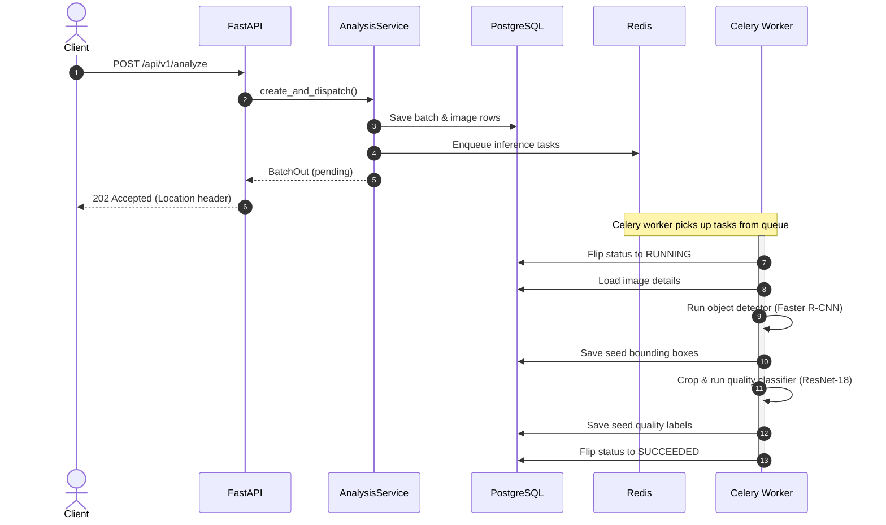

# 06 — Analyze Request Sequence

End-to-end sequence for the unified inference path: client uploads images, and the system processes them asynchronously using a two-stage pipeline.

```mermaid
sequenceDiagram
    autonumber
    actor Client
    participant API as FastAPI
    participant Svc as AnalysisService
    participant DB as PostgreSQL
    participant Q as Redis
    participant W as Celery Worker

    Client->>API: POST /api/v1/analyze
    API->>Svc: create_and_dispatch()
    Svc->>DB: Save batch & image rows
    Svc->>Q: Enqueue inference tasks
    Svc-->>API: BatchOut (pending)
    API-->>Client: 202 Accepted (Location header)

    Note over Q, W: Celery worker picks up tasks from queue
    activate W
    W->>DB: Flip status to RUNNING
    W->>DB: Load image details
    W->>W: Run object detector (Faster R-CNN)
    W->>DB: Save seed bounding boxes
    W->>W: Crop & run quality classifier (ResNet-18)
    W->>DB: Save seed quality labels
    W->>DB: Flip status to SUCCEEDED
    deactivate W
```
