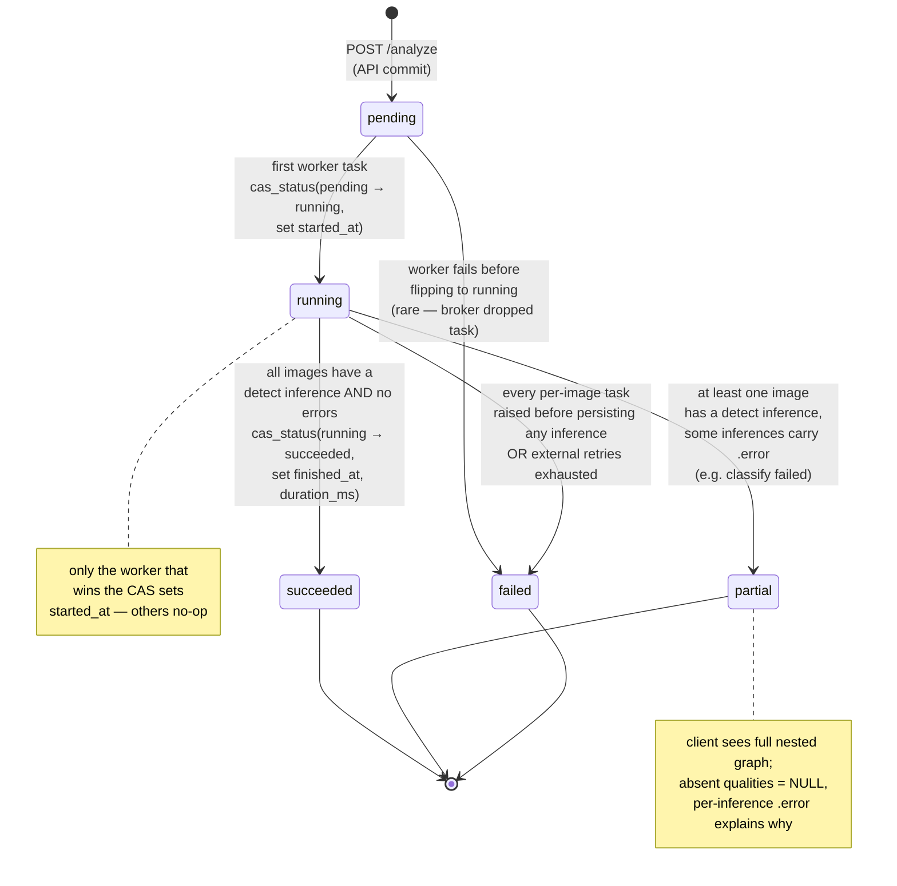

# 07 — Batch State Machine

The lifecycle of `scan_batches.status`. Every transition is a
compare-and-set (`UPDATE … WHERE status = expected RETURNING id`) so
two workers racing on the same batch cannot both flip it. Enum lives
at `infrastructure/db/enums.py::BatchStatus`.

## Diagram



## Why these specific terminal states

| Status | When | What the client sees |
|---|---|---|
| `succeeded` | Every image has at least one detect `inferences` row, and none of those rows have a non-null `error`. | Full nested graph, all detections have a `quality` (or `quality=null` if no classifier was registered for the seed type — different from "classifier failed"). |
| `partial` | At least one image has a detect inference, but some inferences are `error IS NOT NULL`. | Full graph; client can see exactly which image / model failed via `inferences.error`. |
| `failed` | No image produced a successful detect inference (or the worker chain exhausted retries on every image). | Empty `images[].inferences[]` arrays plus `batch.error_message`. |

## Why CAS, not "just an UPDATE"

Workers are concurrent. Two workers picking up two images of the same
batch both try to flip it on the first call. Without the
`WHERE status = 'pending'` guard, the second flip would clobber
`started_at`. The CAS pattern returns the row id only on success, so
the worker code can branch:

```python
flipped = await batches.cas_status(
    batch_id, expected="pending", new="running",
    set_started_at=datetime.now(UTC),
)
if flipped:
    log.info("batch.started", batch_id=batch_id)
# else: another worker already started it; carry on
```

The same pattern guards the terminal flip: only the worker that
processes the *last* image sees `count(distinct image_id with detect
inference) == batch.image_count`, and that worker's CAS is the one
that succeeds.

## What is *not* a state

- `queued` is not a status. The plan originally used it; the schema
  uses `pending` (already running, in front of the worker queue) +
  `running` (a worker has picked it up). The compose stack's
  inference queue is the queue.
- There is no `cancelled` state today. Killing a worker mid-batch
  leaves the batch in `running` until Celery's ack-loss timeout, after
  which it can be re-driven manually. Cancellation is a Phase 6.5
  follow-up.
