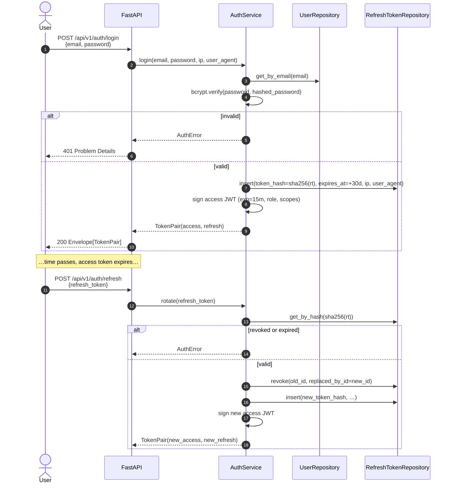
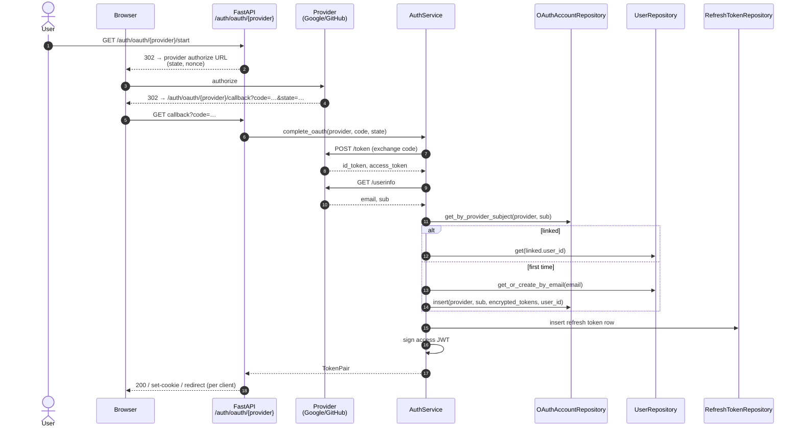
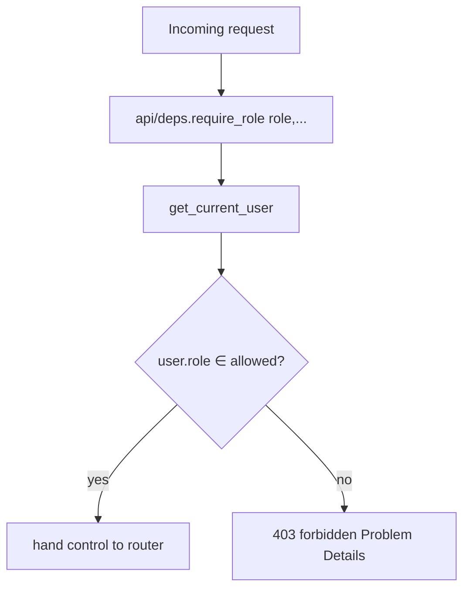

# 08 — Auth Sequences

Three auth flows live behind `/api/v1/auth/*` and one cross-cutting
"present a credential" path used by every other route. Routers in
`api/v1/auth.py`, service in `services/auth_service.py`, RBAC
enforcement in `api/deps.py`.

## Local login + refresh-token rotation



## OAuth (Google / GitHub)



## API-key authentication (per request)

API keys exist for headless clients (SDK, scripts). They short-circuit
JWT verification.

```mermaid
sequenceDiagram
    autonumber
    actor C as Client
    participant API as FastAPI middleware
    participant Dep as api/deps.get_current_user
    participant AKS as ApiKeyService
    participant AKR as ApiKeyRepository

    C->>API: any request<br/>Authorization: Bearer sb_live_… (prefix detected)
    API->>Dep: resolve current_user
    Dep->>AKS: authenticate(raw_key)
    AKS->>AKS: split prefix; sha256 the rest
    AKS->>AKR: get_by_key_hash(hash)
    alt missing / revoked / expired
        AKS-->>Dep: AuthError
        Dep-->>C: 401 Problem Details
    else valid
        AKS->>AKR: touch(last_used_at=now)
        AKS-->>Dep: AuthenticatedUser(role, scopes from key)
    end
    Dep-->>API: AuthenticatedUser
```

## RBAC enforcement (`require_role`)



## Roles and what they can do

| Role | Reads | Writes |
|---|---|---|
| `end_user` | own batches only | submit `POST /analyze`, manage own profile + own API keys |
| `ai_developer` | any batch (read), any model, experiments | register / promote models, run experiments, **per-request `model_id` override on `/analyze`** |
| `admin` | everything | everything (including user role changes, supplier creation) |

The `model_id` override is the single most-tested authz boundary — see
`tests/unit/test_analysis_service.py::TestModelIdOverrideAuthz`.
