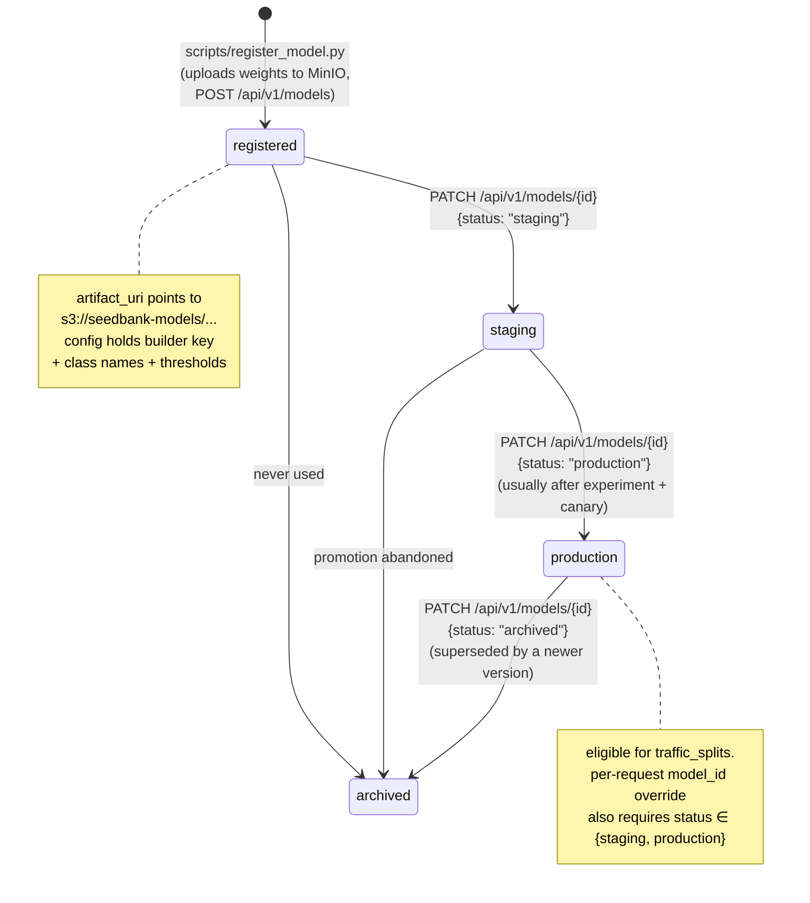
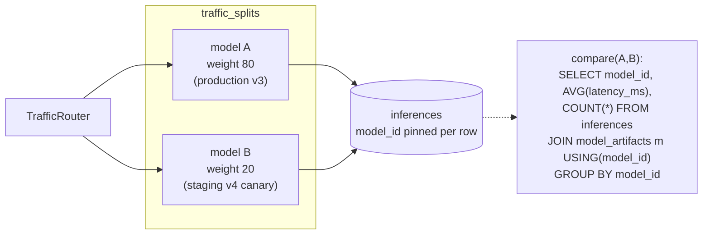
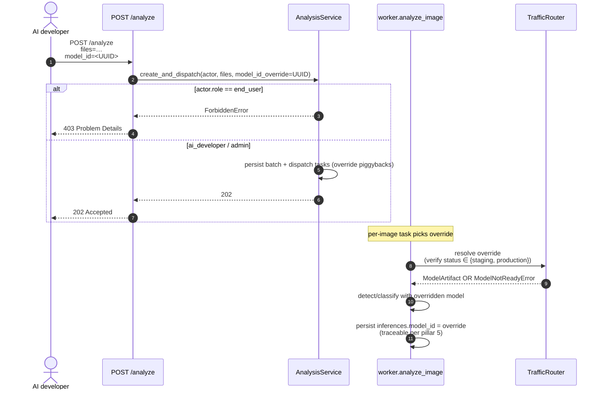

# 09 — ML Platform

How a trained `.pth` becomes production traffic, how A/B is served,
and how an AI developer overrides the router for one request.

## Model lifecycle



Status enum: `infrastructure/db/enums.py::ModelStatus`.

## Traffic router decision tree

`services/traffic_router.py::TrafficRouter.select_model`. Called by
both the worker (one detect call + one classify call per image) and
the experiment runner (later phase).

```mermaid
flowchart TD
    REQ["select_model(kind, seed_type_id, user_id)"]

    OVR{"per-request<br/>model_id<br/>override?"}
    OVRSCOPE{"caller in<br/>{ai_developer, admin}?<br/>+ artifact.status ∈<br/>{staging, production}?"}
    OVR_OK[return overridden model]
    OVR_DENY[ForbiddenError /<br/>ModelNotReadyError]

    SPLITS{"traffic_splits<br/>where kind=…<br/>AND seed_type_id matches<br/>AND is_active<br/>AND now between valid_from/until"}
    PICK[weighted pick by<br/>splits[].weight]
    NONE{"production model for<br/>(kind, seed_type)?"}
    SOLE[return that model]
    EMPTY[ModelNotReadyError]

    REQ --> OVR
    OVR -- yes --> OVRSCOPE
    OVRSCOPE -- yes --> OVR_OK
    OVRSCOPE -- no --> OVR_DENY
    OVR -- no --> SPLITS
    SPLITS -- 1+ rows --> PICK
    SPLITS -- 0 rows --> NONE
    NONE -- yes --> SOLE
    NONE -- no --> EMPTY
```

## A/B in production

Two `traffic_splits` rows, weights summing to 100, same `(kind,
seed_type_id)`. The router picks via deterministic weighted choice;
each per-detection `inferences.model_id` records which one served the
call. The comparison is a SQL join — no extra logging plumbing.



## Per-request override (the AI-developer escape hatch)

The platform's "let me try this model on this exact image without
touching production traffic" path. Allowed for `ai_developer` and
`admin` only.



## Backends: pluggable inference

`infrastructure/ml/backends/`:

| Backend | When | Notes |
|---|---|---|
| `torch_local` | First-party `.pth` weights loaded from MinIO + a registered `@register_builder("…")` arch | Default. Cached in `ModelManager`. |
| `roboflow` | `model.backend = "roboflow"`; calls Roboflow Inference API over `httpx.AsyncClient` | No GPU needed locally. Rate-limited by RB's plan. |
| `yolo` | `model.backend = "yolo"`; uses `ultralytics` package | For YOLOv8/v11 family. |

A new model architecture = one file under `builders/<key>.py` with
`@register_builder("<key>")`. No backend changes. No router changes.

## Pipeline construction

```mermaid
flowchart TB
    REQ["pipeline_factory.get_detect_pipeline(model_artifact)"]
    MM[ModelManager.load<br/>per-process LRU cache,<br/>keyed by model_id]
    BLD[builders/&lt;key&gt;.py<br/>@register_builder]
    BCK[backends/<br/>torch_local / roboflow / yolo]
    PIPE[DetectPipeline /<br/>ClassifyPipeline]

    REQ --> MM
    MM --> BLD
    MM --> BCK
    BLD --> PIPE
    BCK --> PIPE
```

Builders construct the bare arch + load weights from MinIO. Backends
own the "actually run inference" call. Pipeline glues pre-processing
(PIL → tensor) and post-processing (logits → bbox/quality) and is
what the worker actually invokes.
