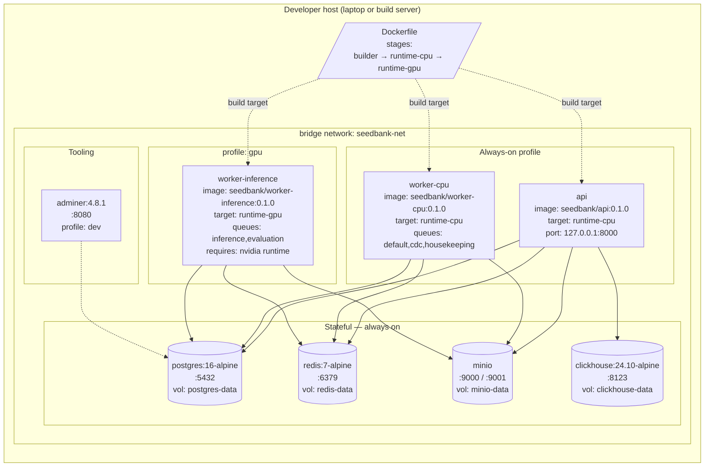
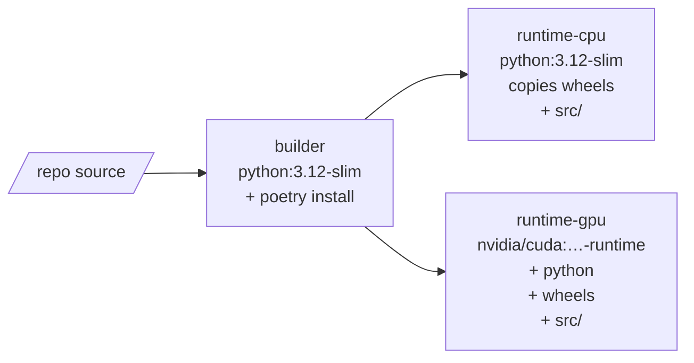

# 10 — Deployment

The Compose deployment view with explicit profiles, ports, and the
build-target boundary between the CPU and GPU images. Maps directly
to `compose.yaml` + `Dockerfile` (multi-stage).

## Diagram

## Profiles

| Profile | Brings up | Why |
|---|---|---|
| (default) | api, worker-cpu, postgres, redis, minio, clickhouse | Full functional stack on a CPU-only laptop. |
| `gpu` | + worker-inference | Real model inference. Requires `nvidia-container-toolkit`. |
| `dev` | + adminer | Local DB browser. Off in CI. |

Activated via `docker compose --profile gpu up` or `make up-gpu`.

## Build stages (`Dockerfile`)

`api` and `worker-cpu` share the **same** `runtime-cpu` image — the
only difference is the `command:` line in compose. `worker-inference`
is a separate image (`runtime-gpu`) so the CUDA layer doesn't bloat
the API container.

## Operational properties

- **Healthchecks** on every service that has a sensible probe; compose
  `depends_on: condition: service_healthy` enforces ordering at
  startup.
- **Resource limits** are set on every service via `deploy.resources`
  (a hint locally, enforced by Swarm/Kubernetes). The lean stack fits
  in ~3 GB RAM.
- **Restart policy** = `unless-stopped` on long-running services.
- **All host ports bind to `127.0.0.1`** — production deployment puts
  a real ingress in front and exposes only the API.
- **Secrets** flow as `${VAR}` references resolved from `.env`
  (gitignored). No secret literals in `compose.yaml`.
- **Logical replication** is enabled on Postgres
  (`wal_level=logical`, `max_replication_slots=4`) so the future CDC
  pipeline to ClickHouse can hook in without a restart.

## What's *not* in the dev compose

- **Sentry** — `SENTRY_DSN` is wired, no container.
- **Reverse proxy / TLS** — added at deployment time (Caddy or an
  ingress controller).
- **Object lifecycle policies on MinIO** — handled by `make seed`'s
  bucket setup script in dev; production sets retention on the
  bucket directly.
- **Backups** — Postgres + MinIO snapshots are an out-of-band concern
  in production; dev volumes are disposable.
