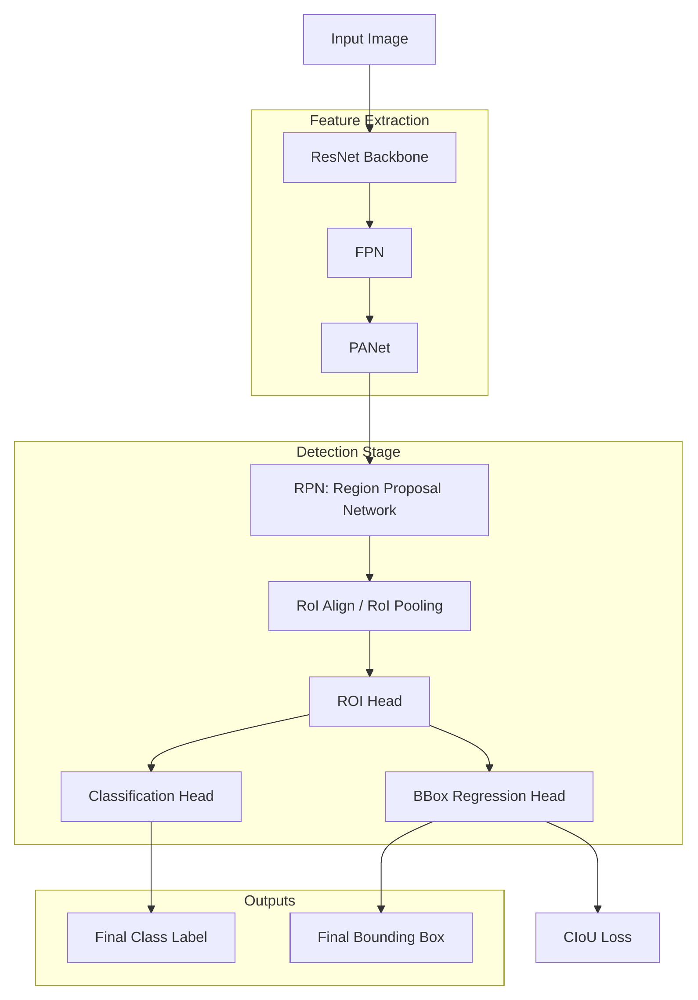
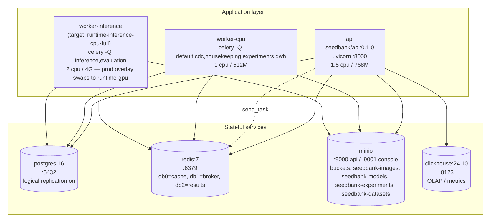

<!-- SLIDE 1 — Title -->

# Seed Bank

## AI-Powered Seed Quality Intelligence

Faculty of Computers and Artificial Intelligence · Cairo University

Supervisors: Dr. Ali Zidane · Dr. Ghada Dahy · Dr. Heba Sherif · Dr. Eman Ahmed

  
AI Omar Ez-Eldin Abdullah · Yussuf Ahmed Awad

  
IS Ali Abdelrahman · Mohamed Amr · Youssef Tarek Ali

  
  

<!--
Open warm and confident — "We built an AI platform that grades seed quality from a single
photo — usable by a farmer in a field or a QA lab." Name the two sub-teams (AI + IS) so the
audience knows the project spans research and a production system.
→ Next: the playful hook — why a "seed bank" in computer science?
-->

---
class: center-slide
---

<!-- SLIDE 2 — A Seed Bank in Computer Science? -->

Act I · The Problem

# A Seed Bank… in Computer Science?

  

    

    <h3>A storage vault?</h3>
    
Preserving seeds for the future

  

  

    

    <h3>…or seed intelligence?</h3>
    
AI that grades seed quality

  

?

<!--
Let the visual do the work — pause on the "?". Ask the room what "seed bank" evokes, then
reveal we mean seed-quality intelligence, not a storage vault.
→ Next: the 30-second version of what it actually does.
-->

---

<!-- SLIDE 3 — The 30-Second Pitch -->

Act I · The Problem

# The 30-Second Pitch

  
 Photograph seeds

  →
  
 AI analyzes

  →
  
 Quality report

  

  

A platform for farmers and QA labs to <strong>instantly grade seed quality</strong> using computer vision — on web and mobile.

<!--
The whole product in one breath — photograph → analyze → report, on web and mobile. Keep it
to three beats; details come later. → Next: who actually needs this.
-->

---

<!-- SLIDE 4 — Who Is This For? -->

Act I · The Problem

# Who Is This For?

  

    

<h3>The Farmer</h3>
Checking quality in the field

    

       Slow counting
       Subjective
       No digital tools
    

  

  

    

<h3>The QA Laboratory</h3>
Grading at throughput

    

       Needs throughput
       Needs objectivity
       Machines too costly
    

  

Two audiences, two pains — and <strong>one backend serves both</strong>.

<!--
Two audiences, two different pains — the farmer wants speed and objectivity; the lab wants
throughput without a six-figure machine. Stress that one backend serves both (paid off in the
platform act). → Next: what today's manual grading looks like.
-->

---

<!-- SLIDE 5 — The Problem: Manual Grading -->

Act I · The Problem

# The Problem: Manual Grading

  

  
Sorting seeds by hand, one tray at a time

   Slow
   Subjective
   Inconsistent
   Can't scale

<!--
Manual grading is slow, subjective, inconsistent, and doesn't scale — the core pain in four
words. → Next: the market gap between manual and industrial.
-->

---

<!-- SLIDE 6 — The Technology Gap -->

Act I · The Problem

# The Technology Gap

  

    

    <h3>Industrial Optical Sorters</h3>
    
$$$$$

  

  

    <h3 style="color:var(--leaf-deep);">Nothing affordable here</h3>
    

    
Seed Bank fills this gap

  

  

    

    <h3>Manual Counting</h3>
    
Cheap, but slow &amp; subjective

  

<!--
There's nothing affordable between hand-counting and industrial optical sorters — that empty
middle is our wedge. → Next: why this is genuinely hard for AI.
-->

---

<!-- SLIDE 7 — Why Seeds Are Hard for AI -->

Act I · The Problem

# Why Seeds Are Hard for AI

  

<h3>Overlap &amp; Clutter</h3>

  

<h3>Lighting Variation</h3>

  

<h3>Subtle Defects</h3>

  

<h3>Natural ≈ Damaged</h3>

<em>Seeds aren't manufactured parts — they're organic and irregular.</em>

<!--
Seeds are organic — overlap, lighting, subtle defects, and healthy-looks-damaged ambiguity.
Not clean manufactured parts. → Next: and the data behind that difficulty.
-->

---

<!-- SLIDE 8 — The Data Problem -->

Act I · The Problem

# The Data Problem

  

<h3>Volume Gap</h3>
Need ~100K images; best public sets have &lt;20K

  

<h3>Annotation Mismatch</h3>
Detection sets have boxes but no quality. Classification sets have labels but no boxes. None has both.

  

<h3>Lab ≠ Real World</h3>
Lab-trained models fail on real-world phone photos

These three problems set up the entire AI journey that follows.

<!--
Three data problems — volume, annotation mismatch, lab≠real-world — are the seeds (pun
intended) of the whole journey. Plant them now; Acts III–IV pay them off.
→ Next: could classic machine learning even solve this?
-->

---

<!-- SLIDE 9 — Can Machine Learning Solve This? -->

Act II · From ML to Computer Vision

# Can Machine Learning Solve This?

We began by asking: can we hand-craft features — size, shape, colour, texture ratios — and classify quality with traditional ML?

  
 Seed image

  →
  
 Measure features

  →
  
 ML classifier

  

<strong>The discovery:</strong> seeds are morphologically complex — hand-crafted features can't generalize across species, defects, and environments.

<!--
We started honestly with hand-crafted features and classic ML — frame it as diligent, not
naive. The discovery: those features don't generalize across species and conditions.
→ Next: the solution we propose.
-->

---
class: arch-slide
---

<!-- SLIDE 10 — The Proposed Solution -->

Act II · From ML to Computer Vision

# The Proposed Solution

"Grade seed quality from an ordinary photo — and manufacture the training data that makes it possible."

  

    

<h3>Seed Bank — the platform</h3>

    <ul style="margin-top:0.5rem;">
      <li>Photo → <strong>find every seed</strong> → <strong>grade each</strong> → aggregate report</li>
      <li>Every verdict <strong>traceable</strong> to its model</li>
      <li>Model management + offline evaluation</li>
      <li>A <strong>web + mobile</strong> app a farmer can use</li>
    </ul>
  

  

    

<h3>MultiSeedGen — the data factory</h3>

    <ul style="margin-top:0.5rem;">
      <li>Cut real seeds from single-seed photos</li>
      <li><strong>Composite</strong> onto realistic backgrounds + camera noise</li>
      <li>Export <strong>fully-labelled</strong> detection datasets</li>
      <li><em>The tool places every seed — labels come for free</em></li>
    </ul>
  

   No expensive rig — ordinary single-view photos
   Closes the ~100K-image data gap

<!--
Before any model details, here's the entire solution on one slide — a platform that grades
seeds from a normal photo, and a data factory that generates the labelled images the detector
needs. Two problems from earlier — cost and data — one deliverable each.
→ Next: why this had to be a computer-vision solution.
-->

---

<!-- SLIDE 11 — Pivoting to Computer Vision -->

Act II · From ML to Computer Vision

# Pivoting to Computer Vision

  
Hand-crafted features → classifier

  →
  
 Raw image → CNN → learned features → classifier

Deep learning extracts generalized features automatically — so we reframed this as a <strong>Computer Vision</strong> problem, with two distinct tasks:

  

<h3>Task 1 — Where is each seed?</h3>
Object Detection

  

<h3>Task 2 — What's wrong with it?</h3>
Quality Classification

▸ This led us to the proposed system architecture — Slides 12–13

<!--
The pivot to deep learning, plus the key reframe: two distinct tasks — where is each seed, and
what's wrong with it. → Next: those two tasks shape our proposed system architecture.
-->

---
class: arch-slide
---

<!-- SLIDE 12 — Proposed System Architecture (1/2) -->

Act II · From ML to Computer Vision

# Proposed System Architecture (1/2)

<h2>The System at a Glance</h2>

  

Clients

A React web app + an Expo mobile app (English / Arabic)

  

FastAPI backend

Accepts a batch, records it, responds fast — async & cleanly layered

  

Background workers

The heavy <strong>detect → classify</strong> work runs <em>off</em> the request path

  

Datastores

PostgreSQL · ClickHouse · MinIO · Redis

Inference is heavy, so it never runs inside the request the user is waiting on — the API stays responsive.

▸ Full container topology at Slide 32 · a live request traced end-to-end at Slide 33

<!--
The system in one picture — clients talk to a fast API, which hands the heavy model work to
background workers, with four datastores behind them. The one idea to land: inference never
blocks the user's request. Keep it conceptual; the deep dive is in the platform act.
→ Next: the two-stage pipeline at the core of it.
-->

---

<!-- SLIDE 13 — Proposed System Architecture (2/2) -->

Act II · From ML to Computer Vision

# Proposed System Architecture (2/2)

<h2>The Two-Stage Detect → Classify Pipeline</h2>

  
 Input image

  →
  
 Stage 1 · Detection<small>Find every seed + type</small>

  →
  
 Crop + group<small>by seed type</small>

  →
  
 Stage 2 · Classification<small>Grade good / bad</small>

  →
  
 Quality report

  
One detector for all seeds. One classifier per crop type. Each stage <strong>versioned &amp; optimized independently.</strong>

  

1 image → N detections → N labels

the data fan-out

▸ The engineering behind it — concurrency-safe batching, per-type routing — is at Slide 33

<!--
This is the architectural spine of the entire project — detect, then classify — and we'll point
back to it repeatedly, including in the platform act. → Next: Phase 1, how we first built the detector.
-->

---

<!-- SLIDE 14 — Phase 1 Detection: Faster R-CNN -->

Act III · Phase 1 — First Pipeline

# Phase 1 Detection: Faster R-CNN

  

    
  

  

    
ResNet-50 backbone + FPN → region proposals → 3 classes [background, coffee, maize]. YOLOv8 tested alongside — comparable at this stage.

    

      

0.98

Faster R-CNN mAP@50

      

0.975

YOLOv8 mAP@50 · ~30ms

    

    
<strong>The problem:</strong> high test metrics, but the model <em>overfitted</em> — it learned the training images, not the concept of "seed".

  

<!--
Phase 1 detection with Faster R-CNN (YOLOv8 tested alongside). Strong test metrics but
overfitting — foreshadow the data problem. Keep the diagram conceptual.
→ Next: the Phase 1 classifier and our four custom modifications.
-->

---

<!-- SLIDE 15 — Phase 1 Classification: ResNet-18 + 4 mods -->

Act III · Phase 1 — First Pipeline

# Phase 1 Classification: ResNet-18 + 4 Custom Modifications

  

<h3>1 · Stride → (1,1)</h3>
Less downsampling — sees hairline cracks &amp; tiny discolorations

  

<h3>2 · CBAM attention</h3>
Forces focus on defect-relevant regions, not background

  

<h3>3 · Hybrid pooling</h3>
GMP + GAP — general patterns AND sharp anomalies

  

<h3>4 · Binary head</h3>
good vs. bad with BCEWithLogitsLoss

  

83.18%

Maize accuracy · F1 0.769 · Recall 0.889

  

0.910

Coffee V3 F1 · Recall 0.934

<!--
The core AI contribution of Phase 1 — four deliberate modifications to ResNet-18 so it can
catch tiny defects. Number them clearly and tie each to why.
→ Next: an honest scorecard of what worked and what didn't.
-->

---

<!-- SLIDE 16 — Phase 1 Results: What Worked / What Didn't -->

Act III · Phase 1 — First Pipeline

# Phase 1 Results: What Worked, What Didn't

  

    <h3> What worked</h3>
    <ul>
      <li>Detection localized seeds accurately in controlled conditions</li>
      <li>ResNet-18 modifications improved classification meaningfully</li>
      <li>Two-stage decoupling proved correct — each stage diagnosable alone</li>
      <li>Maize performed best — it had the highest-quality dataset</li>
    </ul>
  

  

    <h3> What didn't</h3>
    <ul>
      <li>Detection overfitted — poor generalization to new images</li>
      <li>YOLO performed comparably (same data limitation)</li>
      <li>Accuracy decent, but not production-grade</li>
      <li><strong>The dataset was the bottleneck, not the architecture</strong></li>
    </ul>
  

<!--
Honest scorecard — decoupling worked, maize was best (best data), but detection overfit and
accuracy wasn't production-grade. The punchline: the bottleneck was data, not architecture.
→ Next: the insight that reframed the whole project.
-->

---
class: center-slide
---

<!-- SLIDE 17 — We Hit a Wall — The Data Insight -->

Act III · Phase 1 — First Pipeline

# We Hit a Wall — The Data Insight

  ~100,000
  
images per seed type needed to generalize — best public sets have <strong>&lt;20,000</strong>

  
<h3>The dual problem</h3>
Detection sets have boxes but no quality · classification sets have quality but no boxes · <strong>no dataset has both</strong>.

  
<h3>The decision</h3>
<strong>Upgrade the classifier</strong> → EfficientNet-B2 <strong>Build our own data</strong> → MultiSeedGen

<!--
The turning point — we need ~100K images per type, and no public set has both boxes and quality
labels. Two responses follow: a stronger classifier and our own data factory.
→ Next: the classifier upgrade.
-->

---

<!-- SLIDE 18 — Phase 2: Upgrading to EfficientNet-B2 -->

Act IV · Phase 2 — Deeper Models + MultiSeedGen

# Phase 2: Upgrading to EfficientNet-B2

  

    
  

  

    
Same Faster R-CNN detector; swapped <strong>ResNet-18 → EfficientNet-B2</strong> for classification. CBAM + hybrid pooling retained (→ 1024 features).

    
Now <strong>7-class multi-label</strong>: Broken · Damage · Fungus · Healthy · Immature · Shriveled · Weeveled

    

      

0.769

ResNet-18 Maize F1

      

0.974

EfficientNet-B2 Macro-F1

    

  

<!--
EfficientNet-B2 replaces ResNet-18, keeps CBAM + hybrid pooling, and goes from binary to
7-class multi-label. Land the metric jump (0.769 → 0.974).
→ Next: proof it's actually looking at the right thing.
-->

---
class: heatmap-slide
---

<!-- SLIDE 19 — Grad-CAM heatmaps -->

Act IV · Phase 2 — Deeper Models + MultiSeedGen

<h2>EfficientNet-B2 + CBAM learns a different attention pattern for each defect class</h2>

  

Damage 1.00 — focuses on the dark lesion

  

Healthy 1.00 — uniform activation across the clean surface

  

Shriveled 1.00 — focus on the wrinkled deformation

  

Weeveled 1.00 — concentrated hotspot on the bore-hole

The attention mechanism isn't guessing — it's looking at the right features. (Input + 7 class maps; red/yellow = high activation)

<!--
The show-stopper — Grad-CAM proves the attention mechanism focuses on the actual defect for
each class, not the background. Minimal words; let the heatmaps land, maybe one per beat.
→ Next: but detection still needed help.
-->

---
class: center-slide
---

<!-- SLIDE 20 — Detection Still Overfits — We Need Our Own Data -->

Act IV · Phase 2 — Deeper Models + MultiSeedGen

# Detection Still Overfits — We Need Our Own Data

EfficientNet-B2 <strong>solved classification</strong>. But object detection still overfitted — the models memorized training images instead of learning "what a seed looks like."

  

Need ~100K annotated images per type

  

Manual bounding-box annotation is prohibitively slow &amp; error-prone

  

Public datasets are lab-only — don't match the real world

  

<h3 style="color:var(--leaf-deep); font-size:1.2rem;">We built MultiSeedGen — a synthetic data factory generating unlimited, perfectly-labelled detection data</h3>

<!--
Classification is solved; detection still overfits, and manual annotation can't scale. That's
exactly why we built MultiSeedGen. → Next: how MultiSeedGen works.
-->

---

<!-- SLIDE 21 — MultiSeedGen: Building Our Own Training Data -->

Act IV · Phase 2 — Deeper Models + MultiSeedGen

# MultiSeedGen: Building Our Own Training Data

  
 Single-seed photos

  →
  
 Segment

  →
  
 Composite<small>collision physics</small>

  →
  
 Degrade<small>camera sim</small>

  →
  
 Export<small>YOLO / COCO</small>

  

  

    
<strong>Labels come for free</strong> — the engine placed each seed, so it knows exactly where every one is.

    

      6 segmentation backends
      15+ augmentation params
      byte-reproducible
      ~20 species
    

  

<!--
MultiSeedGen is a synthetic data factory — and the killer property is that labels are free,
because the engine placed each seed. Show the annotated output as proof.
→ Next: how we cut seeds out cleanly.
-->

---

<!-- SLIDE 22 — Segmentation: 6 Ways to Cut a Seed -->

Act IV · Phase 2 — Deeper Models + MultiSeedGen

# Segmentation: 6 Ways to Cut a Seed

  

    
1 <strong>auto</strong> — classical cascade + confidence gate + rembg fallback

    
2 <strong>threshold</strong> — border-colour distance (clean backgrounds)

    
3 <strong>otsu</strong> — grayscale Otsu (high-contrast)

    
4 <strong>grabcut</strong> — OpenCV GrabCut (textured backgrounds)

    
5 <strong>rembg (U²-Net)</strong> — learned ONNX, GPU-capable

    
6 <strong>SAM</strong> — prompt-driven: auto, box, or point

  

  

Content-hash cached — the first pass is the only cost. Per-source override via segment-map.

<!--
Six segmentation backends, from simple thresholding to Segment Anything, chosen per image with
a tuner UI. Don't read all six — group as "classical → learned → promptable."
→ Next: how we make synthetic data look real.
-->

---

<!-- SLIDE 23 — Augmentation & Domain Bridging -->

Act IV · Phase 2 — Deeper Models + MultiSeedGen

# Augmentation & Domain Bridging

  
<h3> Geometric</h3><ul><li>Scale jitter · rotation · flip</li><li>Shear · perspective warp</li><li>Collision-aware placement (IoU reject)</li></ul>

  
<h3> Photometric</h3><ul><li>Sensor noise (Gaussian + Poisson)</li><li>JPEG artifacts · motion blur</li><li>Gamma + directional drop shadows</li></ul>

  
<h3 style="color:var(--leaf-deep);"> Domain matching</h3><ul><li><strong>bg_from_sources</strong> — real inpainted trays <em>(biggest lever)</em></li><li><strong>neg_frac</strong> — 10% negatives</li><li><strong>val_seed_holdout</strong> · determinism</li></ul>

<em>Bridging the gap between synthetic and real</em> — compositing onto <strong>real</strong> tray backgrounds was the single biggest quality lever.

<!--
Augmentation plus domain bridging — and the single biggest lever was compositing onto real tray
backgrounds. Emphasize the amber column; the before/after is the proof.
→ Next: the tool itself and the self-improving data loop.
-->

---

<!-- SLIDE 24 — MultiSeedGen Web UI + Data Loop -->

Act IV · Phase 2 — Deeper Models + MultiSeedGen

# MultiSeedGen Web UI + Data Loop

  

    

<h3>Its own Web UI</h3>
React + TypeScript + Tailwind, served by FastAPI

    <ul style="margin-top:0.5rem;"><li>Run tab — config form + live WebSocket logs</li><li>Seg-tuner — per-method preview + quality scoring</li><li>Dataset browser · config presets (YAML)</li></ul>
  

  

    

      
 Generate training data

      ↓
      
 Models train on it

      ↓
      
 Real-world edge cases found

      ↺
      
 Fed back into augmentation

    

  

Each turn of this loop targets the generator at the system's <strong>measured weaknesses</strong>.

<!--
MultiSeedGen is a full tool with its own web UI, and the data feedback loop aims the generator at
the system's measured weaknesses — it's a strategy, not a one-shot script.
→ Next: the detection results after all of this.
-->

---

<!-- SLIDE 25 — Detection Experiments: The Full Journey -->

Act V · Final Results & Evidence

# Detection Experiments: The Full Journey

  
1 Swin Transformer + FPN  overfitted (too powerful for small data) 0.949

  
2 + CIoU loss better box regression, still overfitting 0.981

  
3 ResNet-50 + Faster R-CNN  lower metric, better real-world generalization 0.870

  
4 + PANet improved localization at stricter IoU 0.852

  
5 YOLOv8  fast + accurate, best all-round 0.975

<strong>Lower test metrics ≠ worse model.</strong> After MultiSeedGen, detection trained on 40 seed types with great performance.

<!--
The full detection experiment journey — and the counter-intuitive lesson: lower test metrics can
mean better real-world generalization. → Next: the same lesson, seen in classification.
-->

---

<!-- SLIDE 26 — Classification: Data Quality > Model Architecture -->

Act V · Final Results & Evidence

# Classification: Data Quality > Model Architecture

  

    <h3> Soybean — Lab Data</h3>
    
Sterile backgrounds → <strong class="bad">0.9936 F1</strong>

    
Overfitted — fails on real images

  

  

    <h3> Maize — Real-World Data</h3>
    
Natural sunlight, phone captures → <strong class="ok">0.974 F1</strong>

    
Generalizes to the real world

  

  Epoch 1 · 0.808→
  Epoch 3 · 0.925→
  Epoch 5 · 0.964→
  <strong>Epoch 7 · 0.974</strong>

<em>The model that scored lower on the test set performed better in the real world.</em>

<!--
Data quality beats architecture — the real-world maize model generalizes; the sterile-lab soybean
model overfits despite a higher score. → Next: how we deploy for two very different needs.
-->

---

<!-- SLIDE 27 — Speed vs. Precision -->

Act V · Final Results & Evidence

# Speed vs. Precision: Two Deployment Modes

  

<h3>Precision Mode</h3>
Faster R-CNN + EfficientNet-B2

~230ms · 4.3 FPS7-class multi-labelQA labs

  

<h3>Speed Mode</h3>
YOLOv8

~80ms · 12.5 FPSReal-timeConveyor belts

<strong>876 seeds</strong> detected in one dense frame — a detection-model demo of speed-mode throughput (both run on an RTX 3060).

<!--
Two deployment modes — precision vs speed. Be precise: the 876-seed image is a model demo of
dense detection; the product realtime experience is the mobile frame-streaming mode shown in Act VI.
→ Next: how we compare to what's already out there.
-->

---

<!-- SLIDE 28 — Competitor Landscape -->

Act V · Final Results & Evidence

# Competitor Landscape

| Feature | Seed Bank | LemnaTec | PCS Agri Track | Seedy | GerminationPrediction |
|---|---|---|---|---|---|
| Cost | Low | Very high | Medium | Subscription | Free |
| Accessibility | Web + Mobile | Custom HW | Needs internet | iOS only | CLI only |
| Multi-crop | ~20 species | Many | Limited | Good DB | Germination only |
| Defect granularity | 7-class multi-label | Industrial | Basic | Visual ID | No quality |
| Mobile | Native app | No | Web | iOS | No |
| Open / extensible | Pluggable | Proprietary | Proprietary | Proprietary | OSS |

Affordable, accessible, multi-crop, fine-grained, and extensible — the all-green column is <strong>Seed Bank</strong>.

<!--
Where we sit — affordable, accessible, multi-crop, fine-grained, and extensible. Highlight the
column that's all-green (us). → Next: the models are only half the story — now the platform.
-->

---
class: center-slide
---

<!-- SLIDE 29 — From Trained Models to a Real Product -->

Act VI · The Platform & Engineering

# A Model in a Notebook Helps No One

  

<h3>Trained model</h3>
a lone .pth file

  →
  

<h3 style="margin-top:0.4rem;">A platform two audiences use every day</h3>

   Usable
   Traceable
   Secure

<!--
This is the seam. Everything so far was research; now we turn it into something a farmer and a QA
lab actually use — the IS/backend team's contribution. The three anchor words map to the next slides.
→ Next: let's see it running.
-->

---

<!-- SLIDE 30 — Live App Showcase -->

Act VI · The Platform & Engineering

# Live App Showcase

  

Capture on mobile

  

Review on web

  

AI insights + boxes

  

ML platform behind it

Capture → analyze → review the insights — with a whole ML platform behind it.

<!--
Walk the real farmer journey through the screenshots — capture, analyze, review the insights —
then reveal there's a whole ML platform behind it. Keep captions to one line each.
→ Next: who uses which part, and in which language.
-->

---

<!-- SLIDE 31 — One Platform, Two Audiences, Two Languages -->

Act VI · The Platform & Engineering

# One Platform, Two Audiences — in Two Languages

  

<h3>Farmer (end user)</h3>
Capture · analyze · history · share a read-only report

  

<h3>AI developer / admin</h3>
Models · datasets · experiments · user management

  

<h3 style="color:var(--leaf-deep);">Fully bilingual — English + Arabic with complete RTL mirroring</h3>
Every user-facing string translated; the whole layout flips for Arabic — on web AND mobile, not an afterthought.

<!--
One platform, two role-gated audiences, and it's fully bilingual EN/AR with mirrored RTL on both
web and mobile — a real accessibility win most projects skip. → Next: what's under the hood.
-->

---

<!-- SLIDE 32 — System Architecture -->

Act VI · The Platform & Engineering

# System Architecture

  

    

    

  

  

    <ul>
      <li><strong>Clients</strong> — React 18 web + Expo mobile (EN/AR)</li>
      <li><strong>Backend</strong> — FastAPI, async end-to-end, layered (routers → services → repos), JWT + RBAC</li>
      <li><strong>Datastores</strong> — PostgreSQL (16 tables, UUIDv7) · Redis · MinIO · ClickHouse</li>
      <li><strong>Workers</strong> — worker-inference (torch) · worker-cpu (no torch)</li>
    </ul>
    
7 core services · <code>docker compose up</code>

  

The deep dive on the high-level view from Slide 12 — clean layering is <em>why</em> each piece is swappable and testable.

<!--
The payoff of the high-level architecture we teased at Slide 12 — clean layered design, async
end-to-end, seven core services that come up with one command. Don't go deeper than that.
→ Next: let's follow one photo all the way through.
-->

---
class: dense
---

<!-- SLIDE 33 — The Analyze Pipeline, End-to-End -->

Act VI · The Platform & Engineering

# The Analyze Pipeline, End-to-End

<ol class="steps-2col">
  <li><code>POST /analyze</code> — photos + optional metadata</li>
  <li>Validate → upload to MinIO → create batch (pending) → commit</li>
  <li>Dispatch one background job per image</li>
  <li><strong>DETECT → CROP → GROUP by type → CLASSIFY</strong> each group</li>
  <li>State machine: pending → running → succeeded / partial / failed</li>
  <li>Client polls until a terminal status</li>
</ol>

  

Analyze sequence

  

Batch state machine

Concurrency-safe state machine · per-seed-type routing · graceful partial results

<!--
Trace a single analyze request end-to-end — the two-stage pipeline from Slide 13 in motion: the
fan-out, per-seed-type routing, and the concurrency-safe state machine that degrades gracefully to
"partial" instead of failing. → Next: how every result stays traceable to a model.
-->

---

<!-- SLIDE 34 — Model Traceability & Lifecycle -->

Act VI · The Platform & Engineering

# Model Traceability & Lifecycle

  
 Seed Detection

  → FK →
  
 Inference

  → FK →
  
 Model Artifact

<em>Every single verdict traces back to the exact model version that produced it.</em>

  

<h3>Register</h3>
Upload weights, assign builder, set config

  

<h3>Evaluate</h3>
Offline experiments vs labelled datasets

  

<h3>Promote</h3>
registered → staging → production → archived

ModelResolver serves the production model per (kind, seed_type) — swapping the live model is a <strong>promotion, not a code change</strong>.

<!--
The seam back to the AI story — every detection links by foreign key to the exact model version,
and models move register → evaluate → promote, with the resolver always serving the current
production model. Swapping models is a promotion, not a redeploy. → Next: how we keep it secure.
-->

---

<!-- SLIDE 35 — Secure by Design -->

Act VI · The Platform & Engineering

# Secure by Design

  

<h3>JWT + refresh rotation</h3>
Short-lived tokens; a reused refresh token invalidates the chain

  

<h3>Google OAuth</h3>
Social sign-in alongside email / password

  

<h3>Role-based access</h3>
end_user · ai_developer · admin — on every route

  

<h3>Audit log + one error shape</h3>
Append-only trail; consistent typed errors (RFC 9457)

<!--
Security done properly for a student project — rotating refresh tokens with replay detection,
OAuth, real role-based access, an audit trail, and one consistent error contract. Keep it to the
four tiles; don't rabbit-hole. → Next: the full toolset at a glance.
-->

---

<!-- SLIDE 36 — Tech Stack at a Glance -->

Act VI · The Platform & Engineering

# Tech Stack at a Glance

  

AI / MLPyTorch · torchvision (Faster R-CNN) · EfficientNet-B2 · Ultralytics YOLOv8 · OpenCV · rembg · Pillow · NumPy

  

MultiSeedGenclassical-CV + rembg + SAM segmentation · React + FastAPI web UI

  

WebReact 18 · TypeScript · Vite · Tailwind · shadcn/ui · TanStack Query · Zod · openapi-fetch · lucide-react

  

MobileExpo SDK 56 · React Native 0.85 · expo-camera · React Navigation

  

BackendFastAPI · Python 3.12 · Celery · SQLAlchemy 2 (async) · Pydantic v2 · Alembic

  

DataPostgreSQL 16 · ClickHouse · Redis 7 · MinIO

  

InfraDocker · multi-stage Dockerfile (CPU / GPU) · nginx

  

SecurityJWT + refresh rotation · OAuth (Google) · RBAC

<!--
A quick grouped inventory — don't read every item, let it convey breadth and coherence. Note that
SAM lives in MultiSeedGen, our separate data tool, not the runtime backend. → Next: what we learned.
-->

---

<!-- SLIDE 37 — Key Takeaways -->

Act VII · Closing

# Key Takeaways

  

<h3>Data quality &gt; architecture</h3>
The maize model won because its training data matched the real world.

  

<h3>Decouple detection from classification</h3>
Independent stages let us diagnose and swap each without disturbing the other.

  

<h3>Synthetic data narrows the gap</h3>
MultiSeedGen removed the annotation bottleneck — but always test on real photos.

<!--
Three durable lessons — data > architecture, decouple the two stages, and synthetic data narrows
the gap but real evaluation is the only fair test. → Next: where it goes from here.
-->

---

<!-- SLIDE 38 — Future Roadmap -->

Act VII · Closing

# Future Roadmap

  

 <strong>More Crops</strong> — expand real-world datasets for all 20+ species

  

 <strong>Edge AI</strong> — on-device quantized inference, no internet needed

  

 <strong>Active Learning</strong> — low-confidence scans feed back into MultiSeedGen

  

 <strong>Hardware-Integrated Conveyor</strong> — realtime already ships on mobile; next is fixed-camera lines + instance segmentation

<!--
Future work — more crops, edge AI, active learning; and note honestly that a realtime frame mode
already ships, so the frontier is hardware-integrated conveyor lines and instance segmentation for
overlap, not realtime itself. → Next: thanks and questions.
-->

---
class: cover-slide
---

<!-- SLIDE 39 — Team + Thank You + Questions -->

# Thank You

## Questions?

  
AI Omar Ez-Eldin Abdullah · Yussuf Ahmed Awad

  
IS Ali Abdelrahman · Mohamed Amr · Youssef Tarek Ali

Special thanks to Dr. Ali Zidane · Dr. Ghada Dahy · Dr. Heba Sherif · Dr. Eman Ahmed

  
  

<!--
Thank the supervisors, credit both sub-teams explicitly (research and engineering), and open the
floor warmly. End on the logo.
-->
