<!-- SLIDE 1 — Title -->

# Seed Bank

## A Seed Quality Classification Service Using Computer Vision

Faculty of Computers and Artificial Intelligence / Cairo University

  Supervisors 
  Dr. Eman 
  Dr. Ali Zidane 
  Dr. Heba Sherif 
  Dr. Ghada Dahy

  
AI Omar Ez-Eldin Abdullah · Yussuf Ahmed Awad

  
IS Ali Abdelrahman · Mohamed Amr · Youssef Tarek Ali

<!--
Open warm and confident — "We built an AI platform that grades seed quality from a single
photo — usable by a farmer in a field or a QA lab." Name the two sub-teams (AI + IS) so the
audience knows the project spans research and a production system.
→ Next: the playful hook — why a "seed bank" in computer science?
-->

---
class: center-slide
---

<!-- SLIDE 2 — What is Seed Bank? -->

  

INTRODUCTION

<h1 v-motion :initial="{ opacity: 0, y: 10 }" :enter="{ opacity: 1, y: 0, transition: { duration: 600, delay: 100 } }">What is Seed Bank?</h1>

  

    Seed bank is a quality control application for seeds that relies on Computer Vision for this task
  

  

    <h3 style="margin:0;">Quality assessment</h3>
  

  

    <h3 style="margin:0;">Realtime inference</h3>
  

  

    <h3 style="margin:0;">Data analytics</h3>
  

  

    <h3 style="margin:0;">User Management</h3>
  

<!--
The simplified overview slide.
→ Next: the 30-second pitch.
-->

---

<!-- SLIDE 3 — The Problem -->

INTRODUCTION

# What problem does Seed Bank address?

  <!-- 1. Human Error -->
  

    

    

    

      <h3 style="color: white; margin: 0 0 0.3rem 0; font-size: 1.2rem; font-weight: 900;">Human Error</h3>
      
Manual sorting is subjective and prone to inconsistencies across different inspectors.

    

  

  <!-- 2. Labor Intensive -->
  

    

    

    

      <h3 style="color: white; margin: 0 0 0.3rem 0; font-size: 1.2rem; font-weight: 900;">Labor Intensive</h3>
      
Sifting through massive batches of seeds by hand is painstakingly slow and cannot scale.

    

  

  <!-- 3. Mechanical Sorters -->
  

    

    

    

      <h3 style="color: white; margin: 0 0 0.3rem 0; font-size: 1.2rem; font-weight: 900;">Mechanical Sorters</h3>
      
Massive machines that grade automatically are highly effective, but usually extremely expensive.

    

  

<!--
Introduce the problem: grading seeds manually is prone to human error and is extremely slow.
-->

---

<!-- SLIDE 4 — The Balanced Choice -->

INTRODUCTION

# The Balanced Choice

  

    

    <h3>Mechanical Sieves</h3>
    
High effectiveness

    
Extremely Expensive

  

  
  

    <h3 style="color:var(--leaf-deep); margin-bottom:0.3rem;">Seed Bank</h3>
    

    
The perfect middle ground

    
More effective than human labor. Much cheaper than machines.

  

  
  

    

    <h3>Human Labor</h3>
    
Lowest cost initially

    
Low Effectiveness

  

<!--
Seed Bank is the balanced choice: it brings automation without the massive capital investment of industrial machinery.
-->

---

<!-- SLIDE 5 — The 30-Second Pitch -->

INTRODUCTION

# The 30-Second Pitch

  
 Photograph seeds

  →
  
 AI analyzes

  →
  
 Quality report

  
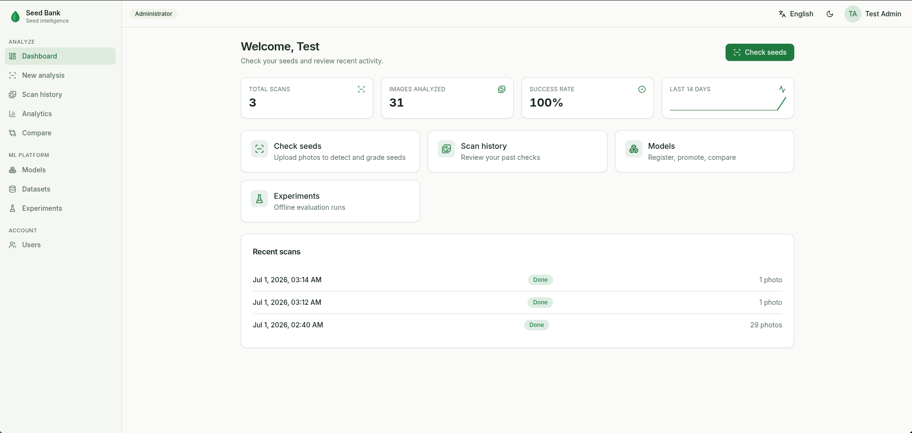

  
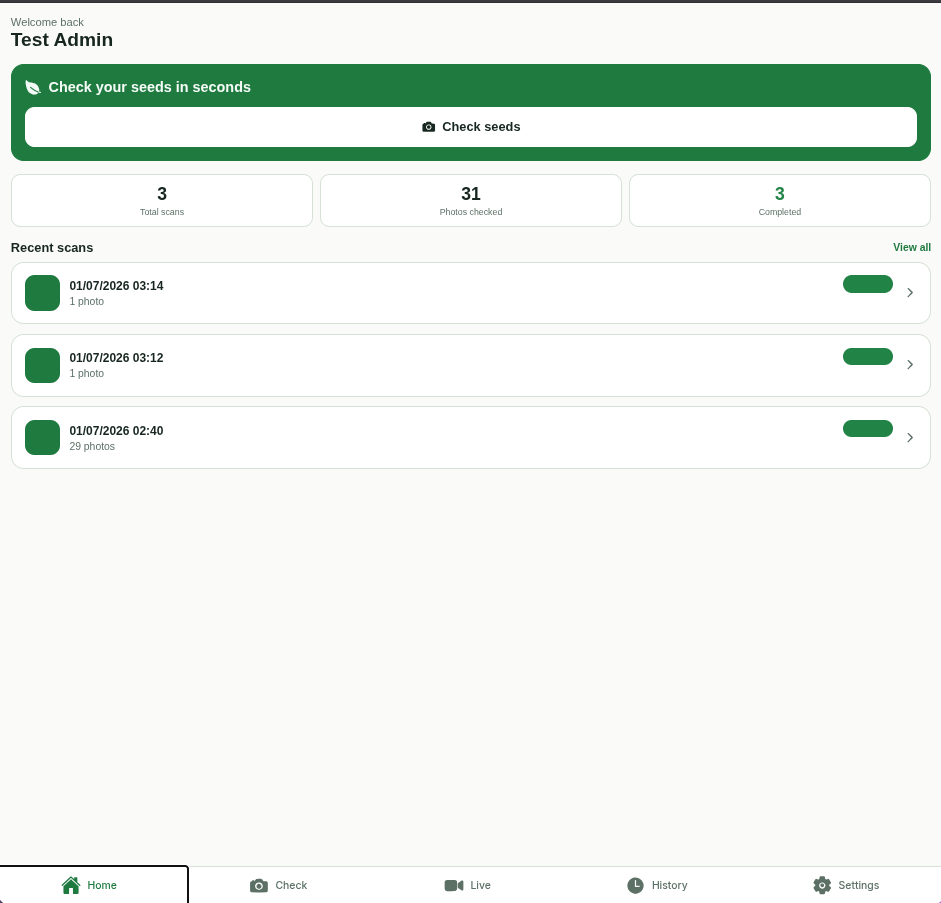

A platform for farmers and QA labs to <strong>instantly grade seed quality</strong> using computer vision — on web and mobile.

<!--
The whole product in one breath — photograph → analyze → report, on web and mobile. Keep it
to three beats; details come later.
-->

---

<!-- SLIDE 6 — Who Is This For? -->

INTRODUCTION

# Who Is This For?

  

    

<h3>The Farmer</h3>
Checking quality in the field

    

       Slow counting
       Subjective
       No digital tools
    

  

  

    

<h3>The QA Laboratory</h3>
Grading at throughput

    

       Needs throughput
       Needs objectivity
       Machines too costly
    

  

Two audiences, two pains — and <strong>one backend serves both</strong>.

<!--
Two audiences, two different pains — the farmer wants speed and objectivity; the lab wants
throughput without a six-figure machine. Stress that one backend serves both.
-->

---

<!-- SLIDE 7 — Why Seeds Are Hard for AI -->

INTRODUCTION

# Why Seeds Are Hard for AI

  

<h3>Overlap &amp; Clutter</h3>

  

<h3>Lighting Variation</h3>

  

<h3>Subtle Defects</h3>

  

<h3>Natural ≈ Damaged</h3>

<em>Seeds aren't manufactured parts — they're organic and irregular.</em>

<!--
Seeds are organic — overlap, lighting, subtle defects, and healthy-looks-damaged ambiguity.
Not clean manufactured parts. → Next: and the data behind that difficulty.
-->

---

<!-- SLIDE 8 — The Data Problem -->

INTRODUCTION

# The Data Problem

  

<h3>Volume Gap</h3>
Need ~100K images; best public sets have &lt;20K

  

<h3>Annotation Mismatch</h3>
Detection sets have boxes but no quality. Classification sets have labels but no boxes. None has both.

  

<h3>Lab ≠ Real World</h3>
Lab-trained models fail on real-world phone photos

These three problems set up the entire AI journey that follows.

<!--
Three data problems — volume, annotation mismatch, lab≠real-world — are the seeds (pun
intended) of the whole journey. Plant them now; Acts III–IV pay them off.
→ Next: could classic machine learning even solve this?
-->

---

<!-- SLIDE 9 — Can Machine Learning Solve This? -->

Act II · From ML to Computer Vision

# Can Machine Learning Solve This?

We began by asking: can we hand-craft features — size, shape, colour, texture ratios — and classify quality with traditional ML?

  
 Seed image

  →
  
 Measure features

  →
  
 ML classifier

  

<strong>The discovery:</strong> seeds are morphologically complex — hand-crafted features can't generalize across species, defects, and environments.

<!--
We started honestly with hand-crafted features and classic ML — frame it as diligent, not
naive. The discovery: those features don't generalize across species and conditions.
→ Next: the solution we propose.
-->

---
class: arch-slide
---

<!-- SLIDE 10 — The Proposed Solution -->

Act II · From ML to Computer Vision

# The Proposed Solution

"Grade seed quality from an ordinary photo — and manufacture the training data that makes it possible."

  

    

<h3>Seed Bank — the platform</h3>

    <ul style="margin-top:0.5rem;">
      <li>Photo → <strong>find every seed</strong> → <strong>grade each</strong> → aggregate report</li>
      <li>Every verdict <strong>traceable</strong> to its model</li>
      <li>Model management + offline evaluation</li>
      <li>A <strong>web + mobile</strong> app a farmer can use</li>
    </ul>
  

  

    

<h3>MultiSeedGen — the data factory</h3>

    <ul style="margin-top:0.5rem;">
      <li>Cut real seeds from single-seed photos</li>
      <li><strong>Composite</strong> onto realistic backgrounds + camera noise</li>
      <li>Export <strong>fully-labelled</strong> detection datasets</li>
      <li><em>The tool places every seed — labels come for free</em></li>
    </ul>
  

   No expensive rig — ordinary single-view photos
   Closes the ~100K-image data gap

<!--
Before any model details, here's the entire solution on one slide — a platform that grades
seeds from a normal photo, and a data factory that generates the labelled images the detector
needs. Two problems from earlier — cost and data — one deliverable each.
→ Next: why this had to be a computer-vision solution.
-->

---

<!-- SLIDE 11 — Pivoting to Computer Vision -->

Act II · From ML to Computer Vision

# Pivoting to Computer Vision

  
Hand-crafted features → classifier

  →
  
 Raw image → CNN → learned features → classifier

Deep learning extracts generalized features automatically — so we reframed this as a <strong>Computer Vision</strong> problem, with two distinct tasks:

  

<h3>Task 1 — Where is each seed?</h3>
Object Detection

  

<h3>Task 2 — What's wrong with it?</h3>
Quality Classification

▸ This led us to the proposed system architecture — Slides 12–13

<!--
The pivot to deep learning, plus the key reframe: two distinct tasks — where is each seed, and
what's wrong with it. → Next: those two tasks shape our proposed system architecture.
-->

---
class: arch-slide
---

<!-- SLIDE 12 — Proposed System Architecture (1/2) -->

Act II · From ML to Computer Vision

# Proposed System Architecture (1/2)

<h2>The System at a Glance</h2>

  

Clients

A React web app + an Expo mobile app (English / Arabic)

  

FastAPI backend

Accepts a batch, records it, responds fast — async & cleanly layered

  

Background workers

The heavy <strong>detect → classify</strong> work runs <em>off</em> the request path

  

Datastores

PostgreSQL · ClickHouse · MinIO · Redis

Inference is heavy, so it never runs inside the request the user is waiting on — the API stays responsive.

▸ Full container topology at Slide 32 · a live request traced end-to-end at Slide 33

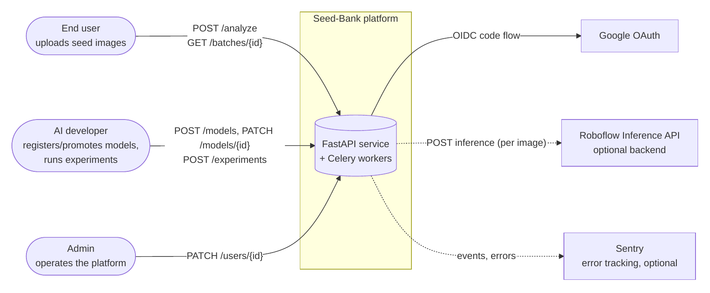

<!--
The system in one picture — clients talk to a fast API, which hands the heavy model work to
background workers, with four datastores behind them. The one idea to land: inference never
blocks the user's request. Keep it conceptual; the deep dive is in the platform act.
→ Next: the two-stage pipeline at the core of it.
-->

---

<!-- SLIDE 13 — Proposed System Architecture (2/2) -->

Act II · From ML to Computer Vision

# Proposed System Architecture (2/2)

<h2>The Two-Stage Detect → Classify Pipeline</h2>

  
 Input image

  →
  
 Stage 1 · Detection<small>Find every seed + type</small>

  →
  
 Crop + group<small>by seed type</small>

  →
  
 Stage 2 · Classification<small>Grade good / bad</small>

  →
  
 Quality report

  
One detector for all seeds. One classifier per crop type. Each stage <strong>versioned &amp; optimized independently.</strong>

  

1 image → N detections → N labels

the data fan-out

▸ The engineering behind it — concurrency-safe batching, per-type routing — is at Slide 33

<!--
This is the architectural spine of the entire project — detect, then classify — and we'll point
back to it repeatedly, including in the platform act. → Next: Phase 1, how we first built the detector.
-->

---

<!-- SLIDE 14 — How It Started & Splitting the Problem -->

Act III · Phase 1 — First Pipeline

# How It Started & Splitting the Problem

  
We first thought of what machine learning model to make, and it was naturally a <strong>Computer Vision</strong> one. Then we asked: <em>what's a good model to fine-tune on?</em>

  
We started very small with a basic ResNet architecture, testing most of its variants from <strong>ResNet-18 up to ResNet-120</strong> to find the optimal balance of speed and feature extraction.

To enable better debugging and handling, we split the challenge into two distinct tasks.

  

    

<h3>Inter-class (Detection)</h3>
Finding the seeds vs. background

    <ul style="margin-top:0.5rem; font-size: 0.95rem;">
      <li>After intensive training, we settled on <strong>ResNet-50</strong> for this task.</li>
      <li>Serves as the backbone to locate regions across classes.</li>
    </ul>
  

  

    

<h3>Intra-class (Classification)</h3>
Grading good vs. bad crops

    <ul style="margin-top:0.5rem; font-size: 0.95rem;">
      <li>We settled on <strong>ResNet-18</strong> for classifying the cropped seeds.</li>
      <li>Added custom modifications (CBAM attention, hybrid pooling).</li>
    </ul>
  

<!--
How it started: decided on CV, started small with ResNet, tested 18-120.
Then split into inter-class (Detection via ResNet-50) and intra-class (Classification via ResNet-18) for better debugging.
→ Next: an honest scorecard of what worked and what didn't in this first pipeline.
-->

---

<!-- SLIDE 15 — Phase 1 Results: What Worked / What Didn't -->

Act III · Phase 1 — First Pipeline

# Phase 1 Results: What Worked, What Didn't

  

    <h3> What worked</h3>
    <ul>
      <li>Detection localized seeds accurately in controlled conditions</li>
      <li>ResNet-18 modifications improved classification meaningfully</li>
      <li>Two-stage decoupling proved correct — each stage diagnosable alone</li>
      <li>Maize performed best — it had the highest-quality dataset</li>
    </ul>
  

  

    <h3> What didn't</h3>
    <ul>
      <li>Detection overfitted — poor generalization to new images</li>
      <li>YOLO performed comparably (same data limitation)</li>
      <li>Accuracy decent, but not production-grade</li>
      <li><strong>The dataset was the bottleneck, not the architecture</strong></li>
    </ul>
  

<!--
Honest scorecard — decoupling worked, maize was best (best data), but detection overfit and
accuracy wasn't production-grade. The punchline: the bottleneck was data, not architecture.
→ Next: the insight that reframed the whole project.
-->

---
class: center-slide
---

<!-- SLIDE 16 — We Hit a Wall — The Data Insight -->

Act III · Phase 1 — First Pipeline

# We Hit a Wall — The Data Insight

  ~100,000
  
images per seed type needed to generalize — best public sets have <strong>&lt;20,000</strong>

  
<h3>The dual problem</h3>
Detection sets have boxes but no quality · classification sets have quality but no boxes · <strong>no dataset has both</strong>.

  
<h3>The decision</h3>
<strong>Upgrade the classifier</strong> → EfficientNet-B2 <strong>Build our own data</strong> → MultiSeedGen

<!--
The turning point — we need ~100K images per type, and no public set has both boxes and quality
labels. Two responses follow: a stronger classifier and our own data factory.
→ Next: the classifier upgrade.
-->

---

<!-- SLIDE 17 — Phase 2: Upgrading to EfficientNet-B2 -->

Act IV · Phase 2 — Deeper Models + MultiSeedGen

# Phase 2: Upgrading to EfficientNet-B2

  

    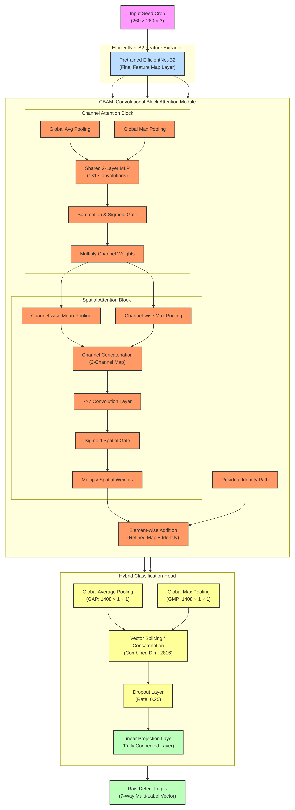
  

  

    
We swapped the <strong>ResNet-18</strong> for the <strong>EfficientNet-B2</strong> for classification. We retained our custom modifications (CBAM + hybrid pooling) to maximize feature extraction.

    

      

0.769

ResNet-18 Maize F1

      

0.974

EfficientNet-B2 Macro-F1

    

  

<!--
EfficientNet-B2 replaces ResNet-18 for classification. Land the metric jump (0.769 → 0.974).
→ Next: proof it's actually looking at the right thing.
-->

---
class: heatmap-slide
---

<!-- SLIDE 18 — Grad-CAM heatmaps -->

Act IV · Phase 2 — Deeper Models + MultiSeedGen

<h2>EfficientNet-B2 + CBAM learns a different attention pattern for each defect class</h2>

  

Damage 1.00 — focuses on the dark lesion
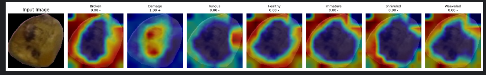

  

Healthy 1.00 — uniform activation across the clean surface
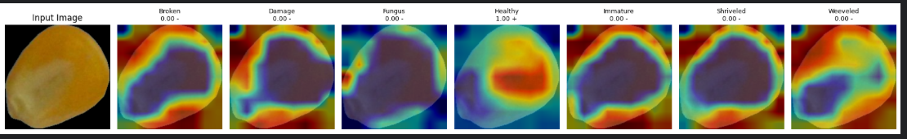

  

Shriveled 1.00 — focus on the wrinkled deformation
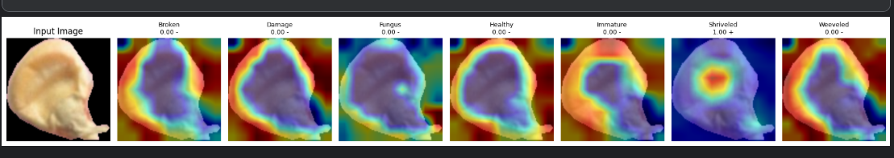

  

Weeveled 1.00 — concentrated hotspot on the bore-hole
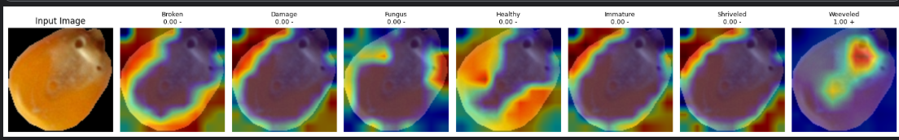

The attention mechanism isn't guessing — it's looking at the right features. (Input + 7 class maps; red/yellow = high activation)

<!--
The show-stopper — Grad-CAM proves the attention mechanism focuses on the actual defect for
each class, not the background. Minimal words; let the heatmaps land, maybe one per beat.
→ Next: but detection still needed help.
-->

---
class: center-slide
---

<!-- SLIDE 19 — Detection Still Overfits — We Need Our Own Data -->

Act IV · Phase 2 — Deeper Models + MultiSeedGen

# Detection Still Overfits — We Need Our Own Data

EfficientNet-B2 <strong>solved classification</strong>. But object detection still overfitted — the models memorized training images instead of learning "what a seed looks like."

  

Need ~100K annotated images per type

  

Manual bounding-box annotation is prohibitively slow &amp; error-prone

  

Public datasets are lab-only — don't match the real world

  

<h3 style="color:var(--leaf-deep); font-size:1.2rem;">We built MultiSeedGen — a synthetic data factory generating unlimited, perfectly-labelled detection data</h3>

<!--
Classification is solved; detection still overfits, and manual annotation can't scale. That's
exactly why we built MultiSeedGen. → Next: how MultiSeedGen works.
-->

---

<!-- SLIDE 20 — MultiSeedGen: Building Our Own Training Data -->

Act IV · Phase 2 — Deeper Models + MultiSeedGen

# MultiSeedGen: Building Our Own Training Data

  
 Single-seed photos

  →
  
 Segment

  →
  
 Composite<small>collision physics</small>

  →
  
 Degrade<small>camera sim</small>

  →
  
 Export<small>YOLO / COCO</small>

  
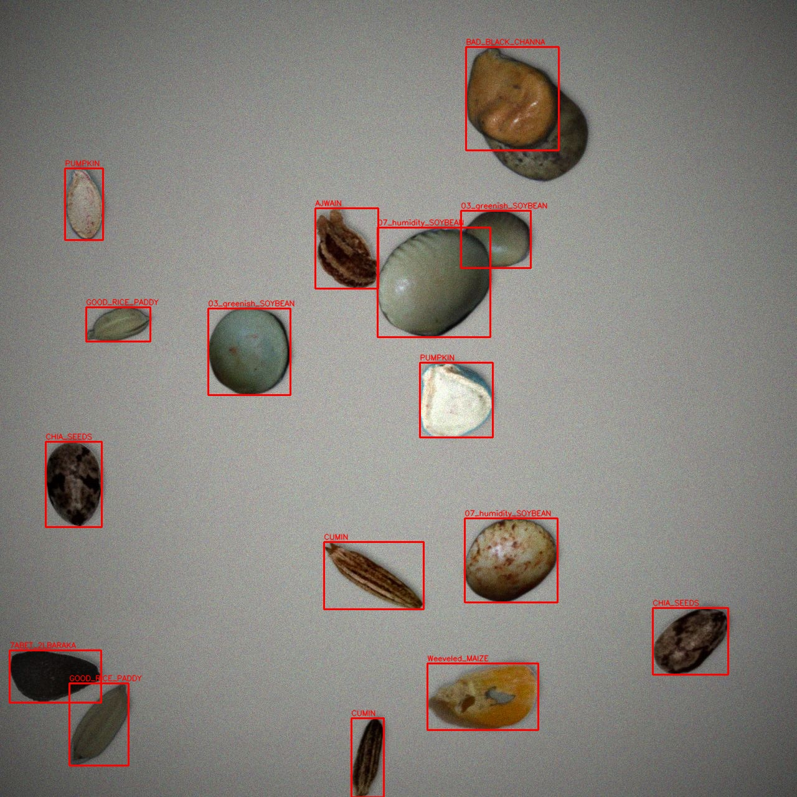

  

    
<strong>Labels come for free</strong> — the engine placed each seed, so it knows exactly where every one is.

    

      6 segmentation backends
      15+ augmentation params
      byte-reproducible
      ~20 species
    

  

<!--
MultiSeedGen is a synthetic data factory — and the killer property is that labels are free,
because the engine placed each seed. Show the annotated output as proof.
→ Next: how we cut seeds out cleanly.
-->

---

<!-- SLIDE 21 — Segmentation: 6 Ways to Cut a Seed -->

Act IV · Phase 2 — Deeper Models + MultiSeedGen

# Segmentation: 6 Ways to Cut a Seed

  

    
1 <strong>auto</strong> — classical cascade + confidence gate + rembg fallback

    
2 <strong>threshold</strong> — border-colour distance (clean backgrounds)

    
3 <strong>otsu</strong> — grayscale Otsu (high-contrast)

    
4 <strong>grabcut</strong> — OpenCV GrabCut (textured backgrounds)

    
5 <strong>rembg (U²-Net)</strong> — learned ONNX, GPU-capable

    
6 <strong>SAM</strong> — prompt-driven: auto, box, or point

  

  
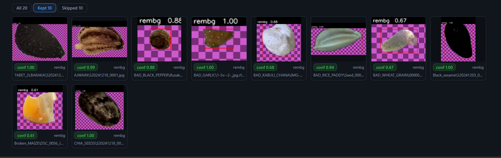

Content-hash cached — the first pass is the only cost. Per-source override via segment-map.

<!--
Six segmentation backends, from simple thresholding to Segment Anything, chosen per image with
a tuner UI. Don't read all six — group as "classical → learned → promptable."
→ Next: how we make synthetic data look real.
-->

---

<!-- SLIDE 22 — Augmentation & Domain Bridging -->

Act IV · Phase 2 — Deeper Models + MultiSeedGen

# Augmentation & Domain Bridging

  
<h3> Geometric</h3><ul><li>Scale jitter · rotation · flip</li><li>Shear · perspective warp</li><li>Collision-aware placement (IoU reject)</li></ul>

  
<h3> Photometric</h3><ul><li>Sensor noise (Gaussian + Poisson)</li><li>JPEG artifacts · motion blur</li><li>Gamma + directional drop shadows</li></ul>

  
<h3 style="color:var(--leaf-deep);"> Domain matching</h3><ul><li><strong>bg_from_sources</strong> — real inpainted trays <em>(biggest lever)</em></li><li><strong>neg_frac</strong> — 10% negatives</li><li><strong>val_seed_holdout</strong> · determinism</li></ul>

<em>Bridging the gap between synthetic and real</em> — compositing onto <strong>real</strong> tray backgrounds was the single biggest quality lever.

<!--
Augmentation plus domain bridging — and the single biggest lever was compositing onto real tray
backgrounds. Emphasize the amber column; the before/after is the proof.
→ Next: the tool itself and the self-improving data loop.
-->

---

<!-- SLIDE 23 — MultiSeedGen Web UI + Data Loop -->

Act IV · Phase 2 — Deeper Models + MultiSeedGen

# MultiSeedGen Web UI + Data Loop

  

    

<h3>Its own Web UI</h3>
React + TypeScript + Tailwind, served by FastAPI

    <ul style="margin-top:0.5rem;"><li>Run tab — config form + live WebSocket logs</li><li>Seg-tuner — per-method preview + quality scoring</li><li>Dataset browser · config presets (YAML)</li></ul>
  

  

    

      
 Generate training data

      ↓
      
 Models train on it

      ↓
      
 Real-world edge cases found

      ↺
      
 Fed back into augmentation

    

  

Each turn of this loop targets the generator at the system's <strong>measured weaknesses</strong>.

<!--
MultiSeedGen is a full tool with its own web UI, and the data feedback loop aims the generator at
the system's measured weaknesses — it's a strategy, not a one-shot script.
→ Next: the detection results after all of this.
-->

---

<!-- SLIDE 24 — Detection Experiments: The Full Journey -->

Act V · Final Results & Evidence

# Detection Experiments: The Full Journey

  
1 Swin Transformer + FPN  overfitted (too powerful for small data) 0.949

  
2 + CIoU loss better box regression, still overfitting 0.981

  
3 ResNet-50 + Faster R-CNN  lower metric, better real-world generalization 0.870

  
4 + PANet improved localization at stricter IoU 0.852

  
5 YOLOv8  fast + accurate, best all-round 0.975

<strong>Lower test metrics ≠ worse model.</strong> After MultiSeedGen, detection trained on 40 seed types with great performance.

<!--
The full detection experiment journey — and the counter-intuitive lesson: lower test metrics can
mean better real-world generalization. → Next: the same lesson, seen in classification.
-->

---

<!-- SLIDE 25 — Classification: Data Quality > Model Architecture -->

Act V · Final Results & Evidence

# Classification: Data Quality > Model Architecture

  

    <h3> Soybean — Lab Data</h3>
    
Sterile backgrounds → <strong class="bad">0.9936 F1</strong>

    
Overfitted — fails on real images

  

  

    <h3> Maize — Real-World Data</h3>
    
Natural sunlight, phone captures → <strong class="ok">0.974 F1</strong>

    
Generalizes to the real world

  

  Epoch 1 · 0.808→
  Epoch 3 · 0.925→
  Epoch 5 · 0.964→
  <strong>Epoch 7 · 0.974</strong>

<em>The model that scored lower on the test set performed better in the real world.</em>

<!--
Data quality beats architecture — the real-world maize model generalizes; the sterile-lab soybean
model overfits despite a higher score. → Next: how we deploy for two very different needs.
-->

---

<!-- SLIDE 26 — Speed vs. Precision -->

Act V · Final Results & Evidence

# Speed vs. Precision: Two Deployment Modes

  

<h3>Precision Mode</h3>
Faster R-CNN + EfficientNet-B2

~230ms · 4.3 FPS7-class multi-labelQA labs

  

<h3>Speed Mode</h3>
YOLOv8

~80ms · 12.5 FPSReal-timeConveyor belts

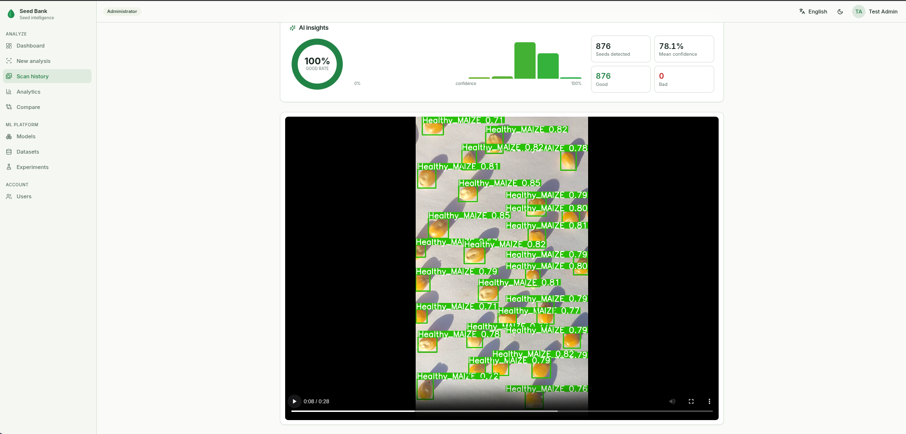

<strong>876 seeds</strong> detected in one dense frame — a detection-model demo of speed-mode throughput (both run on an RTX 3060).

<!--
Two deployment modes — precision vs speed. Be precise: the 876-seed image is a model demo of
dense detection; the product realtime experience is the mobile frame-streaming mode shown in Act VI.
→ Next: how we compare to what's already out there.
-->

---

<!-- SLIDE 27 — Competitor Landscape -->

Act V · Final Results & Evidence

# Competitor Landscape

| Feature | Seed Bank | LemnaTec | PCS Agri Track | Seedy | GerminationPrediction |
|---|---|---|---|---|---|
| Cost | Low | Very high | Medium | Subscription | Free |
| Accessibility | Web + Mobile | Custom HW | Needs internet | iOS only | CLI only |
| Multi-crop | ~20 species | Many | Limited | Good DB | Germination only |
| Defect granularity | 7-class multi-label | Industrial | Basic | Visual ID | No quality |
| Mobile | Native app | No | Web | iOS | No |
| Open / extensible | Pluggable | Proprietary | Proprietary | Proprietary | OSS |

Affordable, accessible, multi-crop, fine-grained, and extensible — the all-green column is <strong>Seed Bank</strong>.

<!--
Where we sit — affordable, accessible, multi-crop, fine-grained, and extensible. Highlight the
column that's all-green (us). → Next: the models are only half the story — now the platform.
-->

---
class: center-slide
---

<!-- SLIDE 28 — From Trained Models to a Real Product -->

Act VI · The Platform &amp; Engineering

# A Model in a Notebook Helps No One

  

<h3>Trained model</h3>
a lone .pth file

  →
  

<h3 style="margin-top:0.4rem;">A product real users rely on</h3>

  

<h3>React Web App</h3>
Dashboard, analytics, ML platform

  

<h3>Expo Mobile App</h3>
Camera capture, realtime grading

  

<h3>FastAPI Backend</h3>
One API serving both clients

   3 roles: end_user · ai_developer · admin
   Usable
   Traceable
   Secure

<!--
This is the seam. Everything so far was research; now we turn it into a product.
The backend serves two client apps (web + mobile). Three user roles control access.
Three anchor words (usable, traceable, secure) map to the next slides.
-->

---

<!-- SLIDE 29A - Live App Showcase: The Farmer Journey -->

Act VI · The Platform &amp; Engineering

# The Farmer Journey

  

Capture on Mobile

  

Review on Web Dashboard

<!--
The farmer's workflow starts in the field on the mobile app, and shifts to the web dashboard for reviewing their entire crop history.
-->

---

<!-- SLIDE 29B - Live App Showcase: The AI Journey -->

Act VI · The Platform &amp; Engineering

# Deep Insights &amp; ML Platform

  

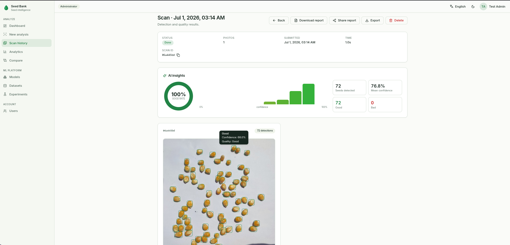

AI Insights &amp; Bounding Boxes

  

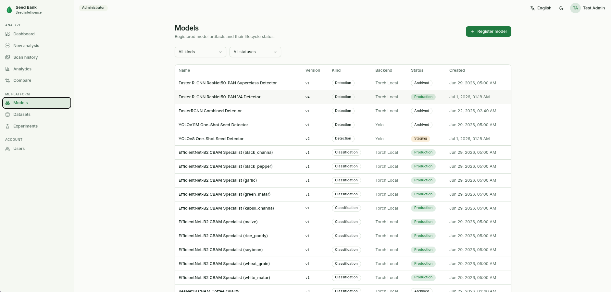

ML Platform for Developers

<!--
Drilling down into a specific batch reveals the bounding boxes and AI insights. And behind the scenes, AI developers use the built-in ML platform to manage datasets and models.
-->

---

<!-- SLIDE 30 — One Backend, Two Apps, Two Languages -->

Act VI · The Platform &amp; Engineering

# One Backend, Two Apps, Two Languages

  

    

<h3>React Web App (Vite + TypeScript)</h3>
Dashboard, batch detail, analytics, compare, ML platform pages

  

  

    

<h3>Expo Mobile App (React Native)</h3>
Camera capture, multi-shot review, realtime grading, history

  

  

<h3>end_user</h3>
Analyze, history, share reports

  

<h3>ai_developer</h3>
Models, datasets, experiments

  

<h3>admin</h3>
Full platform control

  

<h3 style="color:var(--leaf-deep);">Fully bilingual: English + Arabic with complete RTL mirroring</h3>
Every user-facing string translated; the whole layout flips for Arabic on both web and mobile.

<!--
One FastAPI backend serves two client applications. Three role-gated user types control
who sees what. Both apps are fully bilingual EN/AR with RTL layout mirroring.
-->

---

<!-- SLIDE 31 — System Architecture: Application Layer -->

Act VI · The Platform &amp; Engineering

# How It's Built: Application Layer

  

    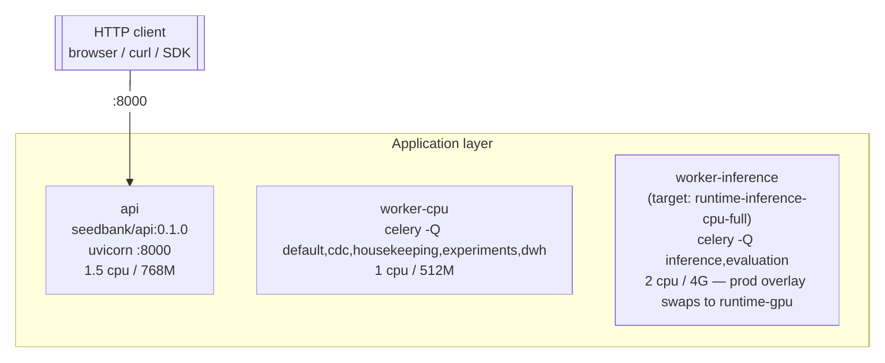
  

  

    

      

<h3>FastAPI (async)</h3>
Routers → Services → Repositories → ORM. Nothing blocks the event loop.

    

    

      

<h3>Two worker types</h3>
<code>worker-inference</code> (GPU, torch) and <code>worker-cpu</code> (analytics, DWH). Split so torch never loads into the lightweight worker.

    

    

      

<h3>Two clients, one API</h3>
React 18 + Vite (web) and Expo SDK 56 (mobile), both hitting <code>/api/v1</code>.

    

  

Inference is heavy, so it never runs inside the request the user is waiting on. The API stays fast.

<!--
How we built it: workers split by dependency weight. The inference worker loads torch (~1.6 GB),
the CPU worker does not. The API itself never imports torch. Everything is async.
-->

---

<!-- SLIDE 32 - System Architecture: Datastores -->

Act VI · The Platform &amp; Engineering

# How It's Built: Data Layer

  

    

    <h3 style="font-size:1.15rem; margin-bottom:0.4rem;">PostgreSQL 16</h3>
    
The core relational backbone. Stores batches, detections, model metadata, and users.

  

  

    

    <h3 style="font-size:1.15rem; margin-bottom:0.4rem;">Redis 7</h3>
    
Serves three crucial roles: fast caching, Celery task broker, and Celery results backend.

  

  

    

    <h3 style="font-size:1.15rem; margin-bottom:0.4rem;">MinIO</h3>
    
S3-compatible object storage for all binary files: images, model weights, and exported datasets.

  

  

    

    <h3 style="font-size:1.15rem; margin-bottom:0.4rem;">ClickHouse</h3>
    
An OLAP star schema specifically built for high-performance aggregations and analytics.

  

<!--
Four datastores, each chosen for a specific reason. PostgreSQL is the relational backbone. Redis doubles as cache and task broker. MinIO stores everything binary. ClickHouse handles analytics. How it gets its data is worth its own slide.
-->

---

<!-- SLIDE 33 - Data Warehouse Population -->

Act VI · The Platform &amp; Engineering

# OLTP to OLAP: The Dual-Write Pattern

  
 Worker finishes inference

  →
  
 Commits to Postgres

  →
  
 Celery dwh task

  →
  
 Reads back from Postgres

  →
  
 Writes to ClickHouse

  

    

<h3>App-level dual-write</h3>
After every Postgres commit, a Celery task is dispatched to the `dwh` queue on the CPU worker.

  

  

    

<h3>Read-back pattern</h3>
The task reads the authoritative state from Postgres. This makes duplicated messages harmless.

  

  

    

<h3>Idempotent by design</h3>
ClickHouse uses a `ReplacingMergeTree`. A duplicate write is simply collapsed at merge time.

  

  

    

<h3>Fire and forget resilience</h3>
If ClickHouse is down, the dispatch is best-effort. Analytics degrade, but the product keeps working.

  

<!--
This is a real data engineering pattern. After the OLTP commit, a lightweight Celery task reads the row back from Postgres and writes dimension and fact rows into ClickHouse. ReplacingMergeTree makes duplicates harmless. The key design decision: ClickHouse can go down without affecting the core product.
-->

---

<!-- SLIDE 34A - The Analyze Request: API Flow -->

Act VI · The Platform &amp; Engineering

# What Happens When You Click "Analyze": The API

  

    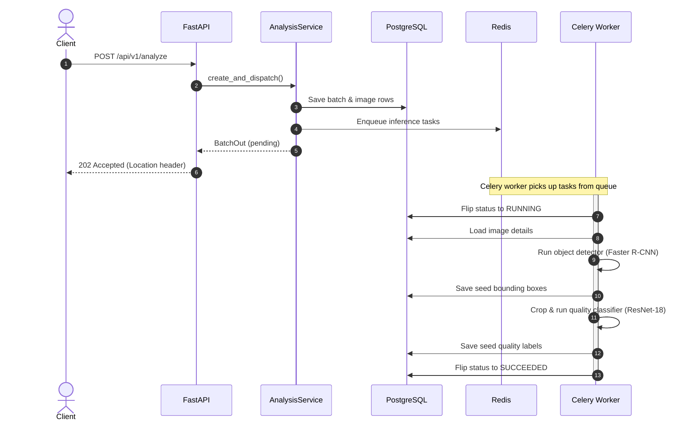
  

  

    <ol class="steps-2col" style="column-count: 1; padding-inline-start: 0; font-size: 0.95rem;">
      <li style="margin-bottom: 0.8rem;"><strong>1. API Request</strong>: The client sends photos via `POST /analyze`.</li>
      <li style="margin-bottom: 0.8rem;"><strong>2. Validate &amp; Upload</strong>: Validate every file, then upload images to MinIO before committing to the database.</li>
      <li style="margin-bottom: 0.8rem;"><strong>3. Database Commit</strong>: Create the pending batch and image rows.</li>
      <li style="margin-bottom: 0.8rem;"><strong>4. Fast Response</strong>: Return a `202 Accepted` status immediately. The user never waits for inference.</li>
    </ol>
  

Validation happens first to fail fast. Storage happens before database commits to prevent broken links.

<!--
Walk through the sequence diagram step by step. The ordering is load-bearing: validate first, store objects, commit to DB. The user gets a response in milliseconds; the heavy work hasn't started yet.
-->

---

<!-- SLIDE 34B - The Analyze Request: Async Call -->

Act VI · The Platform &amp; Engineering

# What Happens When You Click "Analyze": Async Workers

  

    
  

  

    

      

<h3>Dispatch Tasks</h3>
Before the API returns, one Celery task per image is sent to the Redis queue.

    

    

      

<h3>Inference Pipeline</h3>
The GPU worker picks up the task, downloads the image, and runs the heavy ML models.

    

    

      

<h3>Update State</h3>
The worker updates the database with the final results. The client polls until completion.

    

  

Decoupling the inference allows the system to scale workers independently of the web API.

<!--
Now the heavy lifting. The Celery worker picks up the job and runs the inference pipeline. The client is just polling for the batch status to change from pending to succeeded.
-->

---

<!-- SLIDE 36 - Concurrency & Resilience: The Batch State Machine -->

Act VI · The Platform &amp; Engineering

# Handling Failures Gracefully

  
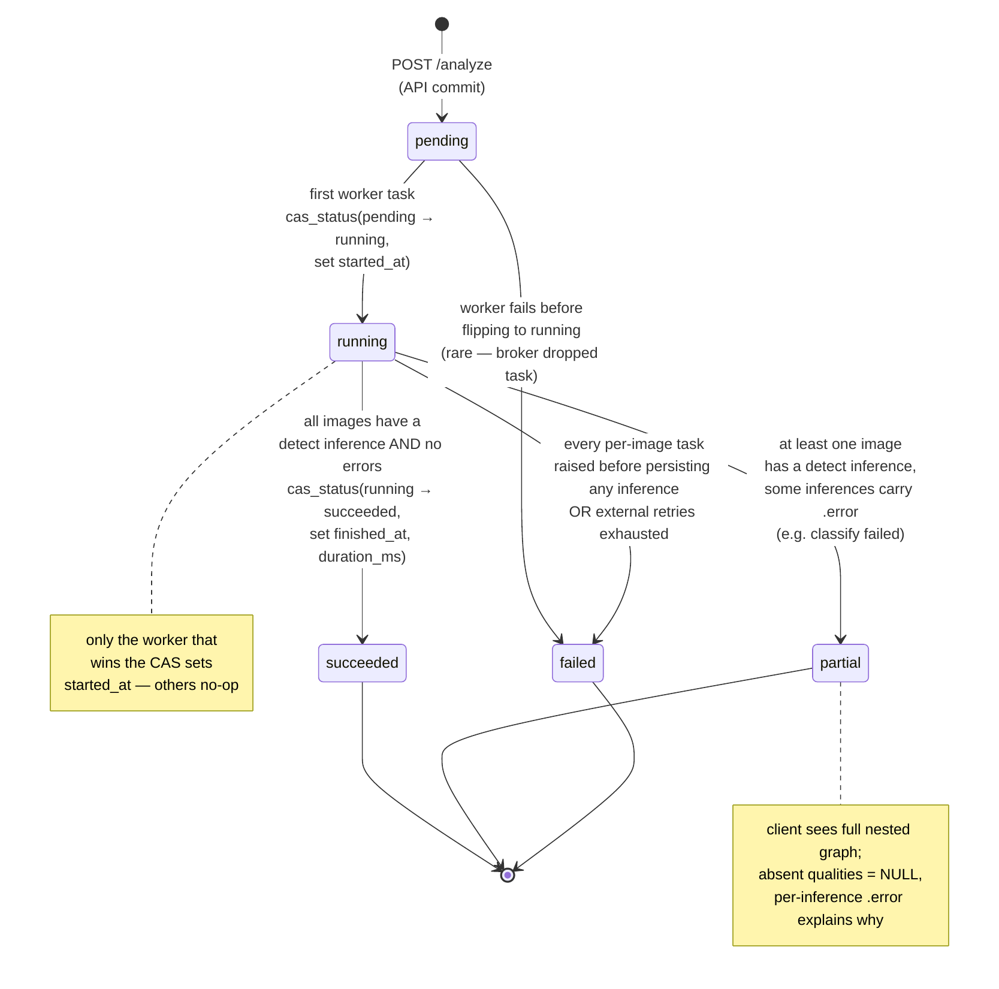

  

    

      <h3> Compare-And-Set (CAS)</h3>
      
State transitions use SQL updates with strict conditions. Two workers on the same batch cannot corrupt state.

    

    

      <h3> succeeded</h3>
      
All images detected and classified successfully.

    

    

      <h3 style="color: var(--amber);"> partial</h3>
      
Detection worked but classification failed on some seeds. We keep the good data instead of throwing it away.

    

    

      <h3 style="color: #c0392b;"> failed</h3>
      
No usable results were produced.

    

  

<!--
The state machine is what makes the system robust. CAS ensures concurrency safety. The partial state is the key design decision. If classification crashes after detection succeeded, we degrade gracefully instead of losing everything.
-->

---

<!-- SLIDE 37 - Model Traceability & Lifecycle -->

Act VI · The Platform &amp; Engineering

# Model Traceability: Every Verdict Has a Source

  
 Seed Detection

  → Foreign Key →
  
 Inference

  → Foreign Key →
  
 Model Artifact

<em>Every single verdict traces back to the exact model version that produced it.</em>

  

<h3>Register</h3>
Upload weights, assign a builder, and set the config.

  

<h3>Evaluate</h3>
Run offline experiments against labelled datasets.

  

<h3>Promote</h3>
Move from registered to staging, then to production.

Swapping the live model is a <strong>promotion, not a code change</strong>.

<!--
This is where the AI story reconnects with the engineering. The foreign key chain is a hard database constraint. The lifecycle means an AI developer uploads new weights, tests them offline, and promotes to production without touching code.
-->

---

<!-- SLIDE 38 - Model Resolution: How the System Picks the Right Model -->

Act VI · The Platform &amp; Engineering

# How the Right Model is Chosen

  

    
1

    <h3 style="font-size: 1.15rem; margin-bottom: 0.4rem;">Per-request override</h3>
    
AI developers can request a specific model ID to test staging models safely on real data.

  

  

    
2

    <h3 style="font-size: 1.15rem; margin-bottom: 0.4rem;">Segment match</h3>
    
The system looks for a production model promoted specifically for this crop type.

  

  

    
3

    <h3 style="font-size: 1.15rem; margin-bottom: 0.4rem;">Global fallback</h3>
    
Uses the global production model if the crop type is unknown, enabling the mobile point-and-shoot flow.

  

  

    
4

    <h3 style="font-size: 1.15rem; margin-bottom: 0.4rem;">Graceful errors</h3>
    
Returns a clear, handled error if no suitable model is ready to process the request.

  

<!--
The ModelResolver decides which model runs for every inference. The global fallback is what makes the mobile point and shoot flow work. Per-request override lets AI developers test a staging model on real data without touching the production path.
-->

---

<!-- SLIDE 39 - Observability & Telemetry -->

Act VI · The Platform &amp; Engineering

# Observability &amp; Telemetry

  

    

    <h3>Distributed Tracing</h3>
    
Every request gets a unique trace ID. It follows the payload from the API, through Celery queues, and into the workers.

  

  

    

    <h3>Application Metrics</h3>
    
We track API latencies, worker queue depths, and inference processing times to spot bottlenecks before they cause timeouts.

  

  

    

    <h3>Centralized Errors</h3>
    
Sentry catches unhandled exceptions in both the API and background workers, grouping them with full stack traces.

  

  

    

    <h3>Structured Logging</h3>
    
JSON logs ensure we can easily search and filter events by user ID, batch ID, or module, instead of parsing plain text.

  

<!--
When you decouple systems into APIs and background workers, you lose the ability to just check a single console. This is why we built proper telemetry. Tracing lets us follow a request across boundaries. Sentry catches errors. Metrics give us the high-level view.
-->

---

<!-- SLIDE 40 - Secure by Design -->

Act VI · The Platform &amp; Engineering

# Security is Not an Afterthought

  

    

    <h3>JWT + Refresh Rotation</h3>
    
Short-lived access tokens. Refresh tokens rotate on use. Reusing an old token invalidates the entire chain.

  

  

    

    <h3>Role-Based Access</h3>
    
Three roles define access. Gates are enforced on every API route and client navigation.

  

  

    

    <h3>Audit Log &amp; Consistent Errors</h3>
    
Append-only record of sensitive actions. All API errors return a stable typed error shape.

  

  

    

    <h3>Rate Limiting</h3>
    
Per-route caps for login, register, and analyze endpoints, backed by Redis.

  

<!--
Security done properly. The replay detection on refresh tokens is the standout feature. If someone steals and reuses an old refresh token, the entire token chain is invalidated. Combined with strict access control, rate limiting, and a full audit trail.
-->

---

<!-- SLIDE 41 - Tech Stack at a Glance -->

Act VI · The Platform &amp; Engineering

# The Full Toolset

  

AI / MLPyTorch · torchvision (Faster R-CNN) · EfficientNet-B2 · Ultralytics YOLOv8 · OpenCV · rembg · Pillow · NumPy

  

MultiSeedGenclassical-CV + rembg + SAM segmentation · React + FastAPI web UI

  

WebReact 18 · TypeScript · Vite · Tailwind · shadcn/ui · TanStack Query · Zod · openapi-fetch · lucide-react

  

MobileExpo SDK 56 · React Native 0.85 · expo-camera · React Navigation

  

BackendFastAPI · Python 3.12 · Celery · SQLAlchemy 2 (async) · Pydantic v2 · Alembic

  

DataPostgreSQL 16 · ClickHouse · Redis 7 · MinIO

  

InfraDocker · multi-stage Dockerfile (CPU / GPU) · nginx

  

SecurityJWT + refresh rotation · RBAC · Rate limiting

<!--
A quick grouped inventory. Let it convey breadth and coherence. This is a real, full-stack product with well-chosen tools at every layer.
-->

---

<!-- SLIDE 42 - Key Takeaways -->

Act VII · Closing

# Key Takeaways

  

<h3>Data quality &gt; architecture</h3>
The maize model won because its training data matched the real world.

  

<h3>Decouple detection from classification</h3>
Independent stages let us diagnose and swap each without disturbing the other.

  

<h3>Synthetic data narrows the gap</h3>
MultiSeedGen removed the annotation bottleneck, but always test on real photos.

<!--
Three durable lessons: data > architecture, decouple the two stages, and synthetic data narrows the gap but real evaluation is the only fair test. -> Next: where it goes from here.
-->

---

<!-- SLIDE 43 - Future Roadmap -->

Act VII · Closing

# Future Roadmap

  

 <strong>More Crops</strong> - expand real-world datasets for all 20+ species

  

 <strong>Edge AI</strong> - on-device quantized inference, no internet needed

  

 <strong>Active Learning</strong> - low-confidence scans feed back into MultiSeedGen

  

 <strong>Hardware-Integrated Conveyor</strong> - realtime already ships on mobile; next is fixed-camera lines + instance segmentation

<!--
Future work: more crops, edge AI, active learning. Note honestly that a realtime frame mode already ships, so the frontier is hardware-integrated conveyor lines and instance segmentation for overlap, not realtime itself. -> Next: thanks and questions.
-->

---
class: cover-slide
---

<!-- SLIDE 44 - Team + Thank You + Questions -->

# Thank You

## Questions?

  
AI Omar Ez-Eldin Abdullah · Yussuf Ahmed Awad

  
IS Ali Abdelrahman · Mohamed Amr · Youssef Tarek Ali

Special thanks to Dr. Ali Zidane · Dr. Ghada Dahy · Dr. Heba Sherif · Dr. Eman Ahmed

  
  

<!--
Thank the supervisors, credit both sub-teams explicitly (research and engineering), and open the floor warmly. End on the logo.
-->
