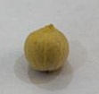
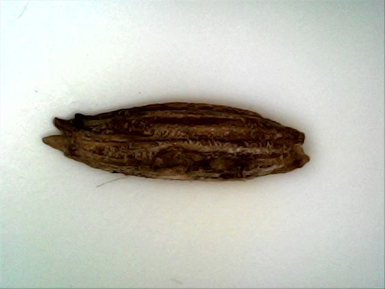
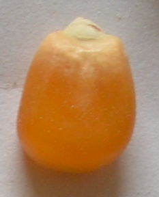
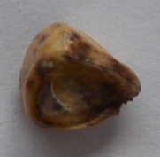
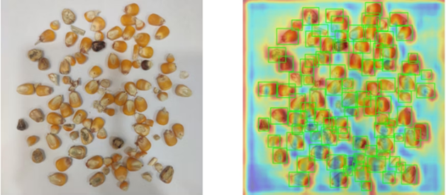
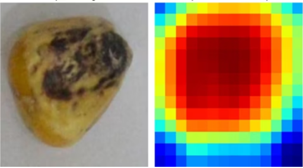
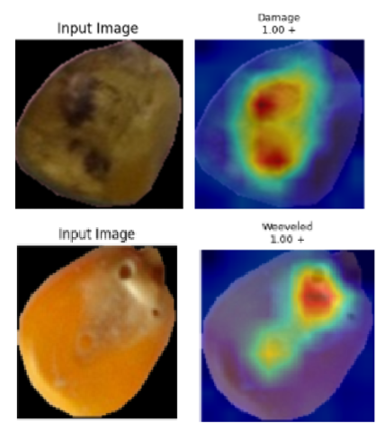

<!-- SLIDE 1 - Title -->

# Seed Bank

## A Seed Quality Classification Service Using Computer Vision

Faculty of Computers and Artificial Intelligence / Cairo University

  Supervisors 
  Dr. Eman 
  Dr. Ali Zidane 
  Dr. Heba Sherif 
  Dr. Ghada Dahy

  
AI Omar Ez-Eldin Abdullah · Yussuf Ahmed Awad

  
IS Ali Abdelrahman · Mohamed Amr · Youssef Tarek Ali

<!--
Open warm and confident. "We built an AI platform that grades seed quality from a single
photo, usable by a farmer in a field or a QA lab." Name the two sub-teams (AI + IS) so the
audience knows the project spans research and a production system.
→ Next: the playful hook, why a "seed bank" in computer science?
-->

---

<!-- SLIDE 2 - Two Groups, One Problem -->

PROBLEM

# Two Groups, One Big Problem

Nearly everyone who works with seeds falls into one of two groups. And both face the same hard question: are these seeds <strong>good, or bad</strong>?<a href="https://www.fao.org/4/i1853e/i1853e01.pdf#:~:text=And%20governments%20complained.%20that%2C%20years%20after%20national,donors%20were%20once%20again%20emphasizing%20improved%20seed." target="_blank" rel="noreferrer">1</a>

  

    

<h3>The Small Farmer</h3>
Little money.<a href="https://documents1.worldbank.org/curated/en/099042424185030624/pdf/P1804801d17e9208184851221aa3cdbbfb.pdf#:~:text=Moreover%2C%20access%20to%20finance%20by%20small%20agri-food,water%20quality%20challenges%2C%20both%20of%20which%20constrain." target="_blank" rel="noreferrer">2</a> Only a few seeds.

    

       Judged by eye
       Slow hand work
    

    
They judge each seed by eye, so two people can easily disagree. And sorting by hand, seed by seed, takes forever.

  

  

    

<h3>The Big Factory</h3>
A lot of money. A huge amount of seeds.

    

       High repair cost
       Costs a lot to run
    

    
Big machines do the sorting on their own. But they cost a fortune to buy, to fix, and to run every day.

  

  <strong>1.</strong> <a href="https://www.fao.org/4/i1853e/i1853e01.pdf" target="_blank" rel="noreferrer">FAO: Promoting the growth and development of smallholder seed enterprises</a>
  &nbsp;·&nbsp;
  <strong>2.</strong> <a href="https://documents1.worldbank.org/curated/en/099042424185030624/pdf/P1804801d17e9208184851221aa3cdbbfb.pdf" target="_blank" rel="noreferrer">World Bank: Small agri-food firms and access to finance</a>

<!--
Two groups with the same problem: the small farmer (little money, a few seeds) and the big factory
(lots of money, huge volume). Click to reveal each side while you talk about it. Sources: FAO on
seed quality mattering to smallholders, World Bank on their limited access to finance.
Next: both old ways of solving this have a problem.
-->

---

<!-- SLIDE 3 - Both Old Ways Have a Problem -->

PROBLEM

# Both Old Ways Have a Problem

  

    <h3> Human Labor</h3>
    
It is <strong class="bad">cheap</strong> to start. But people judge by eye, so the answer shifts from one person to the next. It is <strong class="bad">slow</strong>, too, and it can not keep up with big loads.

    
 The small farmer's only choice.

  

  

    <h3> Mechanical Sorters</h3>
    
They are <strong>fast</strong>, and they never change their mind. But the machines are <strong class="bad">very costly</strong> to buy and to keep running.

    
 Only big factories can pay for them.

  

One way is <strong>not fair</strong>. The other <strong>costs too much</strong>. And neither one helps <em>both</em> groups.

<!--
The tension: the two old options sit at opposite ends. Human labor is cheap but not fair and slow.
Machines are fast but far too costly. Each one fits only one group, and neither fits both. Click to
bring in each card as you talk. Next: our answer.
-->

---

<!-- SLIDE 4 - Our Answer: Seed Bank -->

SOLUTION

# Our Answer: Seed Bank

  
Seed Bank is an app that checks seed quality with <strong>AI</strong>. You just take a photo. It finds every seed and tells you which ones are good and which are bad.

  

    

    <h3>Human Labor</h3>
    
Not fair. Too slow.

  

  →
  

    

    <h3 style="color:var(--leaf-deep);">Seed Bank</h3>
    
The best of both

    
More sure than the eye. Much cheaper than machines.

  

  ←
  

    

    <h3>Mechanical Sorters</h3>
    
Works well. Too costly.

  

It works in two simple steps. First it <strong>finds each seed</strong>. Then it <strong>grades each one</strong>, good or bad.

<!--
The answer sits in the middle. The two side options are already familiar from the last slide, so
click to pop in the Seed Bank card as the resolution, then click to reveal the two AI steps
(find each seed, then grade it). The deep dive comes later in the AI pipeline section.
Next: the idea in one line.
-->

---

<!-- SLIDE 6 - One Tool for Both Groups -->

SOLUTION

# One Tool for Both Groups

  

    

<h3>Mobile app, for the farmer</h3>
Take a photo in the field

    
Just point your phone and snap. The answer comes back right there in the field. No lab, no costly machine.

  

  

    

<h3>Conveyor mode, for the factory</h3>
A fixed camera over a moving belt

    
A fixed camera watches the moving belt, and the same app grades seed after seed. It brings automation without the very costly machine.

  

The same AI runs in two ways, and <strong>one system powers both</strong>.

  
<h3 style="margin:0; font-size:1rem;">Quality check</h3>

  
<h3 style="margin:0; font-size:1rem;">Quick results</h3>

  
<h3 style="margin:0; font-size:1rem;">Charts &amp; history</h3>

  
<h3 style="margin:0; font-size:1rem;">Your account</h3>

<!--
The same AI ships in two forms: a mobile app for the small farmer, and a conveyor mode for the big
factory (a fixed camera over a belt). One backend serves both. Click through the two cards, then the
four things it does. Next: our proposed system and what it does.
-->

---

<!-- SLIDE 7 - Our Answer: The Seed Bank System -->

SOLUTION

# Our Answer: The Seed Bank System

"Show Seed Bank your seeds: a photo, a batch, or live video, and get a clear good-or-bad report, on a phone in the field or on the web in a lab."

  
 Capture<small>photo · batch · video / live</small>

  →
  
 Find every seed

  →
  
 Grade each one

  →
  
 Analysis

  

<h3>For the farmer</h3>
Snap a batch, get the analysis, and look back over your history, on web or mobile, in English or Arabic.

  

<h3>For the AI team</h3>
Manage the models, run evaluations, and trace every result back to the exact model that made it.

<!--
The whole system in one breath: photo in, quality report out. Two kinds of user: the farmer
checking a batch, and the AI team running the models behind it. No tooling detail yet.
→ Next: how we stack up against what already exists.
-->

---

<!-- SLIDE 8 - Competitor Landscape -->

RELATED WORK

# Competitor Landscape

| Feature | Seed Bank | LemnaTec | PCS Agri Track | Seedy | GerminationPrediction |
|---|---|---|---|---|---|
| Cost | Low | Very high | Medium | Subscription | Free |
| Accessibility | Web + Mobile | Custom HW | Needs internet | iOS only | CLI only |
| Multi-crop | ~20 species | Many | Limited | Good DB | Germination only |
| Defect granularity | 7-class multi-label | Industrial | Basic | Visual ID | No quality |
| Mobile | Native app | No | Web | iOS | No |
| Open / extensible | Pluggable | Proprietary | Proprietary | Proprietary | OSS |

Affordable, works anywhere, many crops, fine-grained, and open to extend. The all-green column is us, <strong>Seed Bank</strong>.

<!--
Where we sit: affordable, accessible, multi-crop, fine-grained, and extensible. Highlight the
column that's all-green (us). → Next: how the system works, at a glance.
-->

---

<!-- SLIDE 11 - Why did we use Deep Learning? -->

AI PIPELINE · APPROACH

# Why did we use Deep Learning?

For complex Computer Vision tasks, traditional Machine Learning hits a hard ceiling due to its reliance on <strong>manual feature engineering</strong>.

  
 Raw Pixels

  →
  
 Hidden Layers

  →
  
 Abstract Features

  

<em>"Deep learning allows models... to learn representations of data with multiple levels of abstraction."</em>  <small>- LeCun, Bengio, &amp; Hinton (Nature, 2015)</small>

  

    <h3 style="margin-bottom:0.2rem;"> Automatic Feature Extraction</h3>
    
Unlike classic ML, Deep Learning doesn't require hand-crafted features (shape, color). It directly extracts optimal high-level features from raw images.

  

  

    <h3 style="margin-bottom:0.2rem;"> Multiple Hidden Parameters</h3>
    
Seeds are organic with massive unstructured variance. The deep architecture's hidden parameters capture these complex, non-linear patterns perfectly.

  

  

    <h3 style="margin-bottom:0.2rem;"> Unmatched CV Performance</h3>
    
In visual classification, DL is the industry standard because its performance dynamically scales, easily surpassing the structural limits of traditional ML.

  

<!--
Explain that manual feature engineering fails on organic, irregular objects like seeds.
Deep layers extract high-level features automatically with millions of hidden parameters, making DL structurally superior for CV.
-->

---

<!-- SLIDE 13 - Splitting the Problem -->

AI PIPELINE · Phase 1

# Splitting the Problem

To solve this effectively, we split the challenge based on Inter-class and Intra-class variance.

  

    

      

      

        <h3>Inter-class Variance</h3>
        
Differences BETWEEN species

      

    

    <ul style="margin-top:0.8rem; font-size:0.9rem; color:var(--text); line-height: 1.4;">
      <li><strong>Macro-level traits:</strong> Core shape, size, and texture differences between Maize, Cotton, etc.</li>
      <li><strong>Easier to learn:</strong> Species are visually distinct from one another.</li>
      <li><strong>Our Use Case:</strong> Detection (finding the seed vs background).</li>
    </ul>
    

      

        
        Black Pepper
      

      

        
        Cumin
      

    

  

  

    

      

      

        <h3>Intra-class Variance</h3>
        
Differences WITHIN the same species

      

    

    <ul style="margin-top:0.8rem; font-size:0.9rem; color:var(--text); line-height: 1.4;">
      <li><strong>Micro-level traits:</strong> Subtle cracks, discoloration, or tiny fungal spots on the exact same seed type.</li>
      <li><strong>Harder to learn:</strong> The core object remains identical, requiring fine-grained analysis.</li>
      <li><strong>Our Use Case:</strong> Quality Classification (Healthy vs Defective).</li>
    </ul>
    

      

        
        Healthy Maize
      

      

        
        Damaged Maize
      

    

  

<!--
We split based on variance: Inter-class (macro differences between species used for Detection) and Intra-class (micro differences within a species used for Classification).
-->

---

<!-- SLIDE 14 - Detection Results -->

AI PIPELINE · Phase 1

# Inter-class research results

  

    
We first used <strong>Faster R-CNN with a ResNet-50 backbone</strong> to compare initial results on single-class (maize) versus multi-class (maize & coffee).

    
These predicted coordinates are then used to crop and extract the specific seed region, passing only the isolated <strong>"Region of Interest" (RoI)</strong> to the classification model. This two-stage approach ensures the classifier focuses exclusively on the seed features, eliminating noise from the background or adjacent seeds.

  

  

    
  

<table style="width: 100%; text-align: left; border-collapse: collapse; font-size: 0.8rem;"><thead><tr style="border-bottom: 1px solid var(--leaf-line);"><th style="padding: 0.2rem;">Metric</th><th style="padding: 0.2rem;">Std Faster R-CNN <small>(Maize only)</small></th><th style="padding: 0.2rem;">+ CBAM <small>(Maize only)</small></th><th style="padding: 0.2rem;">Std Faster R-CNN <small>(Maize & Coffee)</small></th><th style="padding: 0.2rem;">+ CBAM <small>(Maize & Coffee)</small></th><th style="padding: 0.2rem;">YOLOv8s <small>(Alternative)</small></th></tr></thead><tbody><tr style="border-bottom: 1px solid rgba(0,0,0,0.05);"><td style="padding: 0.2rem; font-weight: 600;">Avg Inference Time</td><td style="padding: 0.2rem;">0.1511s</td><td style="padding: 0.2rem;">0.0621s</td><td style="padding: 0.2rem;">0.1038s</td><td style="padding: 0.2rem;">0.1106s</td><td style="padding: 0.2rem; font-weight:bold; color:var(--leaf-deep);">5.5ms</td></tr><tr style="border-bottom: 1px solid rgba(0,0,0,0.05);"><td style="padding: 0.2rem; font-weight: 600;">mAP@50 (Standard)</td><td style="padding: 0.2rem;">0.9780</td><td style="padding: 0.2rem;">0.9768</td><td style="padding: 0.2rem;">0.9838</td><td style="padding: 0.2rem;">0.9835</td><td style="padding: 0.2rem;">0.9410</td></tr><tr style="border-bottom: 1px solid rgba(0,0,0,0.05);"><td style="padding: 0.2rem; font-weight: 600;">mAP@75 (Strict)</td><td style="padding: 0.2rem;">0.6574</td><td style="padding: 0.2rem;">0.6576</td><td style="padding: 0.2rem;">0.8015</td><td style="padding: 0.2rem;">0.8020</td><td style="padding: 0.2rem; color:var(--mut);">-</td></tr><tr style="border-bottom: 1px solid rgba(0,0,0,0.05);"><td style="padding: 0.2rem; font-weight: 600;">mAP@.5:.95 (COCO)</td><td style="padding: 0.2rem;">0.5903</td><td style="padding: 0.2rem;">0.5867</td><td style="padding: 0.2rem;">0.7038</td><td style="padding: 0.2rem;">0.7211</td><td style="padding: 0.2rem; color:var(--mut);">-</td></tr><tr style="border-bottom: 1px solid rgba(0,0,0,0.05);"><td style="padding: 0.2rem; font-weight: 600;">Precision</td><td style="padding: 0.2rem; color:var(--mut);">-</td><td style="padding: 0.2rem; color:var(--mut);">-</td><td style="padding: 0.2rem; color:var(--mut);">-</td><td style="padding: 0.2rem; color:var(--mut);">-</td><td style="padding: 0.2rem;">0.9390</td></tr><tr><td style="padding: 0.2rem; font-weight: 600;">Recall</td><td style="padding: 0.2rem; color:var(--mut);">-</td><td style="padding: 0.2rem; color:var(--mut);">-</td><td style="padding: 0.2rem; color:var(--mut);">-</td><td style="padding: 0.2rem; color:var(--mut);">-</td><td style="padding: 0.2rem;">0.9410</td></tr></tbody></table>

<!--
The Faster R-CNN metrics compared with and without CBAM for single vs multi class.
YOLOv8s added as a high-speed alternative reference.
-->

---

<!-- SLIDE 15 - Optimizing Inter-class Detection (Table + Outcomes) -->

AI PIPELINE · Phase 1

# Optimizing Inter-class Detection

A controlled sweep of backbone and loss-function upgrades to push localization accuracy. Each row isolates one architectural change so its effect on training cost and the strict mAP metrics is directly attributable.

<table style="width: 100%; text-align: left; border-collapse: collapse; font-size: 0.9rem;"><thead><tr style="border-bottom: 1px solid var(--leaf-line);"><th style="padding: 0.3rem;">Architecture Setup</th><th style="padding: 0.3rem;">Training Time (Avg)</th><th style="padding: 0.3rem;">mAP@50</th><th style="padding: 0.3rem;">mAP@75</th><th style="padding: 0.3rem;">mAP@0.50:0.95</th></tr></thead><tbody><tr style="border-bottom: 1px solid rgba(0,0,0,0.05);"><td style="padding: 0.3rem; font-weight: 600;">Test 1: Swin backbone + FPN</td><td style="padding: 0.3rem;">430.08 s</td><td style="padding: 0.3rem;">0.9487</td><td style="padding: 0.3rem;">0.5543</td><td style="padding: 0.3rem;">0.5827</td></tr><tr style="border-bottom: 1px solid rgba(0,0,0,0.05); background: rgba(30,122,64,0.05);"><td style="padding: 0.3rem; font-weight: 600;">Test 2: Swin backbone + FPN + CIoU Loss</td><td style="padding: 0.3rem; color: #d97706; font-weight: bold;">729.53 s (↑)</td><td style="padding: 0.3rem; color: var(--leaf-deep); font-weight: bold;">0.9805 (↑)</td><td style="padding: 0.3rem; color: var(--leaf-deep); font-weight: bold;">0.7078 (↑)</td><td style="padding: 0.3rem; color: var(--leaf-deep); font-weight: bold;">0.6585 (↑)</td></tr><tr style="border-bottom: 1px solid rgba(0,0,0,0.05);"><td style="padding: 0.3rem; font-weight: 600;">Test 3: ResNet-50 + Faster R-CNN</td><td style="padding: 0.3rem; color: var(--mut);">394.58s</td><td style="padding: 0.3rem;">0.8697</td><td style="padding: 0.3rem;">0.5466</td><td style="padding: 0.3rem;">0.5253</td></tr><tr><td style="padding: 0.3rem; font-weight: 600;">Test 4: ResNet-50 + Faster R-CNN + PANet</td><td style="padding: 0.3rem;">391.98 s</td><td style="padding: 0.3rem; color: #dc2626; font-weight: bold;">0.8524 (↓)</td><td style="padding: 0.3rem; color: var(--leaf-deep); font-weight: bold;">0.6952 (↑)</td><td style="padding: 0.3rem; color: var(--leaf-deep); font-weight: bold;">0.6142 (↑)</td></tr></tbody></table>

  

    <h3 style="font-size: 0.95rem; margin: 0 0 0.35rem 0;"> CIoU Loss (Test 1 → 2)</h3>
    
Penalizes box aspect-ratio and center distance, not just overlap → far tighter boxes (<strong>mAP@75 0.55 → 0.70</strong>). Trade-off: training time nearly doubled (430s → 729s).

  

  

    <h3 style="font-size: 0.95rem; margin: 0 0 0.35rem 0;"> PANet (Test 3 → 4)</h3>
    
Bottom-up path augmentation preserves low-level edge detail → precise localization (<strong>mAP@75 +0.15</strong>). Trade-off: stricter box matching nudged loose mAP@50 down slightly.

  

<!--
The optimization sweep and its outcomes on one slide: CIoU tightens boxes at a training-cost hit;
PANet sharpens strict localization but trades a sliver of loose mAP@50.
-->

---

<!-- SLIDE 17 - Intra-class Quality Models (First Results) -->

AI PIPELINE · Phase 2

# Intra-class Quality Models (Maize)

To tackle <strong>intra-class variance</strong> (quality classification), we began with a Baseline ResNet-18 and systematically introduced architectural modifications. These initial tests evaluate the model's ability to classify healthy versus defective <strong>maize seeds</strong>.

<table style="width: 100%; text-align: left; border-collapse: collapse; font-size: 0.85rem;"><thead><tr style="border-bottom: 1px solid var(--leaf-line);"><th style="padding: 0.5rem;">Model Version</th><th style="padding: 0.4rem;">Architecture Modifications</th><th style="padding: 0.4rem;">F1-Score</th><th style="padding: 0.4rem;">Precision</th><th style="padding: 0.4rem;">Recall</th></tr></thead><tbody><tr style="border-bottom: 1px solid rgba(0,0,0,0.05);"><td style="padding: 0.4rem; font-weight: 600;">V1</td><td style="padding: 0.4rem;">Baseline ResNet-18</td><td style="padding: 0.4rem;">0.9056</td><td style="padding: 0.4rem;">0.8898</td><td style="padding: 0.4rem;">0.9219</td></tr><tr style="border-bottom: 1px solid rgba(0,0,0,0.05);"><td style="padding: 0.4rem; font-weight: 600;">V2</td><td style="padding: 0.4rem;">+ CBAM</td><td style="padding: 0.4rem;">0.9023</td><td style="padding: 0.4rem;">0.8988</td><td style="padding: 0.4rem;">0.9058</td></tr><tr style="border-bottom: 1px solid rgba(0,0,0,0.05); background: rgba(30,122,64,0.05);"><td style="padding: 0.4rem; font-weight: 600;">V3</td><td style="padding: 0.4rem;">+ CBAM + GMP</td><td style="padding: 0.4rem; color: var(--leaf-deep); font-weight: bold;">0.9101</td><td style="padding: 0.4rem;">0.8877</td><td style="padding: 0.4rem; color: var(--leaf-deep); font-weight: bold;">0.9335</td></tr><tr><td style="padding: 0.4rem; font-weight: 600;">V4</td><td style="padding: 0.4rem;">+ CBAM + GMP + Stride (1,1)</td><td style="padding: 0.4rem;">0.9000</td><td style="padding: 0.4rem;">0.8803</td><td style="padding: 0.4rem;">0.9206</td></tr></tbody></table>

  

    <h3 style="font-size: 0.95rem; margin: 0 0 0.55rem 0;"> The V3 Sweet Spot</h3>
    
Adding <strong>Global MaxPooling (GMP)</strong> alongside CBAM (V3) forced the network to identify the single most discriminative feature (like a tiny defect crack on the maize surface), pushing both F1 and Recall to their highest points.

  

  

    <h3 style="font-size: 0.95rem; margin: 0 0 0.55rem 0;"> Stride (1,1) Degradation</h3>
    
Attempting to retain ultra-fine spatial resolution by altering the early convolution stride (V4) actually harmed the network. It introduced too much background noise, causing a regression across all metrics compared to V3.

  

<!--
Initial intra-class variance classification results on Maize using ResNet-18.
-->

---

<!-- SLIDE 18 - EfficientNet-B2: Maize vs Soybean -->

AI PIPELINE · Phase 2

# Upgrading to EfficientNet-B2

  
To improve fine-grained, multi-label defect classification, we upgraded to <strong>EfficientNet-B2</strong>. Its compound scaling dynamically balances depth, width, and resolution, allowing it to extract much richer feature representations. Crucially, we maintained the exact same <strong>V3 configuration</strong> that succeeded previously, integrating <strong>CBAM block attention</strong> and <strong>Hybrid Pooling (GMP)</strong> into the new architecture.

  

    <h3 style="font-size: 0.95rem; margin: 0 0 0.4rem 0;"> Maize (Robust Generalization)</h3>
    <table style="width: 100%; text-align: left; border-collapse: collapse; font-size: 0.75rem; margin-bottom: 0.6rem;">
      <thead><tr style="border-bottom: 1px solid rgba(0,0,0,0.1);"><th style="padding:0.2rem;">Epoch</th><th style="padding:0.2rem;">Val Loss</th><th style="padding:0.2rem;">Macro-F1</th><th style="padding:0.2rem;">Micro-F1</th><th style="padding:0.2rem;">Exact Match</th></tr></thead>
      <tbody>
        <tr style="border-bottom: 1px solid rgba(0,0,0,0.05);"><td style="padding:0.2rem;">001</td><td style="padding:0.2rem;">0.2695</td><td style="padding:0.2rem;">0.8078</td><td style="padding:0.2rem;">0.8016</td><td style="padding:0.2rem;">0.6224</td></tr>
        <tr style="border-bottom: 1px solid rgba(0,0,0,0.05);"><td style="padding:0.2rem;">003</td><td style="padding:0.2rem;">0.1027</td><td style="padding:0.2rem;">0.9253</td><td style="padding:0.2rem;">0.9242</td><td style="padding:0.2rem;">0.8658</td></tr>
        <tr style="border-bottom: 1px solid rgba(0,0,0,0.05);"><td style="padding:0.2rem;">005</td><td style="padding:0.2rem;">0.0555</td><td style="padding:0.2rem;">0.9641</td><td style="padding:0.2rem;">0.9640</td><td style="padding:0.2rem;">0.9387</td></tr>
        <tr><td style="padding:0.2rem; font-weight:bold;">007</td><td style="padding:0.2rem; font-weight:bold;">0.0447</td><td style="padding:0.2rem; color:var(--leaf-deep); font-weight:bold;">0.9740</td><td style="padding:0.2rem; font-weight:bold;">0.9740</td><td style="padding:0.2rem; font-weight:bold;">0.9565</td></tr>
      </tbody>
    </table>
    
Photographed under natural sunlight with variable background noise. The model successfully learned robust, generalizable features, achieving stable convergence.

  

  
  

    <h3 style="font-size: 0.95rem; margin: 0 0 0.4rem 0;"> Soybean (Severe Overfitting)</h3>
    <table style="width: 100%; text-align: left; border-collapse: collapse; font-size: 0.75rem; margin-bottom: 0.6rem;">
      <thead><tr style="border-bottom: 1px solid rgba(0,0,0,0.1);"><th style="padding:0.2rem;">Epoch</th><th style="padding:0.2rem;">Val Loss</th><th style="padding:0.2rem;">Macro-F1</th><th style="padding:0.2rem;">Micro-F1</th><th style="padding:0.2rem;">Exact Match</th></tr></thead>
      <tbody>
        <tr style="border-bottom: 1px solid rgba(0,0,0,0.05);"><td style="padding:0.2rem;">001</td><td style="padding:0.2rem;">0.2614</td><td style="padding:0.2rem;">0.8114</td><td style="padding:0.2rem;">0.7977</td><td style="padding:0.2rem;">0.6464</td></tr>
        <tr style="border-bottom: 1px solid rgba(0,0,0,0.05);"><td style="padding:0.2rem;">004</td><td style="padding:0.2rem;">0.0516</td><td style="padding:0.2rem;">0.9603</td><td style="padding:0.2rem;">0.9597</td><td style="padding:0.2rem;">0.9278</td></tr>
        <tr style="border-bottom: 1px solid rgba(0,0,0,0.05);"><td style="padding:0.2rem;">008</td><td style="padding:0.2rem;">0.0235</td><td style="padding:0.2rem;">0.9889</td><td style="padding:0.2rem;">0.9888</td><td style="padding:0.2rem;">0.9829</td></tr>
        <tr><td style="padding:0.2rem; font-weight:bold;">012</td><td style="padding:0.2rem; font-weight:bold;">0.0203</td><td style="padding:0.2rem; color:#dc2626; font-weight:bold;">0.9936</td><td style="padding:0.2rem; font-weight:bold;">0.9936</td><td style="padding:0.2rem; font-weight:bold;">0.9916</td></tr>
      </tbody>
    </table>
    
Pre-segmented boxes in sterile, lab-controlled environments. The network merely memorized clean pixel distributions (reaching an artificially high 0.9936) and failed to learn robust real-world features.

  

<!--
Comparing EfficientNet-B2 classification on Maize vs Soybean datasets, proving data quality dictates generalizability.
-->

---

<!-- SLIDE - The Attention Gap: Grad-CAM -->

AI PIPELINE · Phase 2

# The Attention Gap: ResNet-18 V3 vs EfficientNet-B2

Grad-CAM heatmaps reveal where a model actually looks when it predicts. A real architecture upgrade should not just lift the numbers on paper; it should visibly move the model's focus onto the defect regions instead of irrelevant background.

  

    
    <h3 style="font-size:0.95rem; margin:0.7rem 0 0.35rem;">ResNet-18 V3: Diffuse Attention</h3>
    
Heat is scattered across the whole seed and bleeds into the background. The model leans on general texture rather than the defect signatures, so it never localizes fine-grained intra-class features.

  

  

    
    <h3 style="font-size:0.95rem; margin:0.7rem 0 0.35rem;">EfficientNet-B2 + CBAM: Targeted Attention</h3>
    
Heat concentrates on the actual defect: the crack or lesion that defines the class. CBAM's channel and spatial gates suppress background noise and converge attention onto the meaningful region.

  

  <strong>More than a metric gain: the model learns to see defects the way a human expert would. CBAM plus Hybrid Pooling on EfficientNet-B2 yields attention that is both precise and interpretable.</strong>

<!--
Grad-CAM comparison: old ResNet-18 V3 spreads attention everywhere, the new EfficientNet-B2 + CBAM locks
onto the actual defect. The upgrade changed where the model looks, not just its score.
-->

---
class: center-slide
---

<!-- SLIDE 18 - Detection Still Overfits - We Need Our Own Data -->

AI PIPELINE · Phase 2 + MultiSeedGen

# Detection Still Overfits - We Need Our Own Data

EfficientNet-B2 <strong>solved classification</strong>. But object detection still overfitted - the models memorized training images instead of learning "what a seed looks like."

  

Need ~100K annotated images per type

  

Manual bounding-box annotation is prohibitively slow &amp; error-prone

  

Public datasets are lab-only - don't match the real world

  

<h3 style="color:var(--leaf-deep); font-size:1.2rem;">We built MultiSeedGen - a synthetic data factory generating unlimited, perfectly-labelled detection data</h3>

<!--
Classification is solved; detection still overfits, and manual annotation can't scale. That's
exactly why we built MultiSeedGen. → Next: how MultiSeedGen works.
-->

---

<!-- SLIDE 19 - MultiSeedGen: Why & How -->

AI PIPELINE · MultiSeedGen

# Solving Source Overfitting with Synthetic Data

  

    <h3 style="margin: 0 0 0.5rem 0;"> Why we built it</h3>
    
Synthetic datasets combat two critical failure modes: <strong>(1) insufficient real-sample diversity</strong>, which causes the model to overfit to source-specific pixel patterns, and <strong>(2) sterile, controlled backgrounds</strong> that prevent generalization to real-world noise. MultiSeedGen was built to solve both simultaneously.

  

  

    <h3 style="margin: 0 0 0.7rem 0;"> How the pipeline works</h3>
    

      
 <strong>1 · Ingest</strong>

      →
      
 <strong>2 · Segment</strong>

      →
      
 <strong>3 · Synthesize</strong>

    

    <ul style="font-size: 0.8rem; line-height: 1.45; margin: 0.7rem 0 0 0; color: var(--text);">
      <li><strong>Ingest</strong> - reads structured image subfolders, one subfolder per seed class / defect label.</li>
      <li><strong>Segment</strong> - isolates each seed instance from its source image, removing the original background entirely.</li>
      <li><strong>Synthesize</strong> - composites the cut-outs onto diverse background textures and applies offline augmentations (randomized lighting, blur, JPEG artifacts, noise) to mimic real capture conditions.</li>
    </ul>
  

<!--
MultiSeedGen exists to kill source overfitting: real data lacks diversity and has sterile backgrounds.
The 3-stage pipeline - ingest structured class folders, segment out each seed, then synthesize onto
varied backgrounds with realistic augmentation. → Next: the full configuration reference.
-->

---

<!-- SLIDE 21 - MultiSeedGen: Example Output -->

AI PIPELINE · MultiSeedGen

# Generated Dataset Sample

  

  

<strong>Labels come for free.</strong> Because the engine <em>placed</em> each seed, every instance is annotated automatically with bounding-box coordinates and class labels in the configured format (COCO / YOLO) - making the generated dataset plug-and-play for any downstream detector.

<!--
The generated sample with automatic bounding-box annotations. The engine placed each seed, so labels
are exact and free, exported in COCO/YOLO - plug-and-play for any detector. → Next: the detection journey.
-->

---

<!-- SLIDE 23 - Detection Experiments: The Full Journey -->

RESULTS

# Detection Experiments: The Full Journey

  
1 Swin Transformer + FPN  overfitted (too powerful for small data) 0.949

  
2 + CIoU loss better box regression, still overfitting 0.981

  
3 ResNet-50 + Faster R-CNN  lower metric, better real-world generalization 0.870

  
4 + PANet improved localization at stricter IoU 0.852

  
5 YOLOv8  fast + accurate, best all-round 0.975

<strong>Lower test metrics ≠ worse model.</strong> After MultiSeedGen, detection trained on 20 seed types with great performance.

<!--
The full detection experiment journey - and the counter-intuitive lesson: lower test metrics can
mean better real-world generalization. → Next: the same lesson, seen in classification.
-->

---

<!-- SLIDE 24 - Our Best Detection Model: YOLOv8 + MultiSeedGen -->

AI PIPELINE · Final Results

# Our Best Detection Model: YOLOv8 + MultiSeedGen

Our best detection, especially on maize, came from <strong>YOLOv8</strong> trained on the <strong>MultiSeedGen</strong> synthetic dataset. Being single-stage and end-to-end, YOLOv8 generalizes far better than two-stage Faster R-CNN on synthetic-heavy data.

  

    <h3 style="font-size: 0.95rem; margin: 0 0 0.6rem 0;"> YOLOv8: Maize Detection</h3>
    <table style="width: 100%; text-align: left; border-collapse: collapse; font-size: 0.9rem;"><tbody><tr style="border-bottom: 1px solid rgba(0,0,0,0.05);"><td style="padding: 0.45rem 0.4rem;">Training time / epoch</td><td style="padding: 0.45rem 0.4rem; color: var(--leaf-deep); font-weight: bold;">23.0 – 23.9 s</td></tr><tr style="border-bottom: 1px solid rgba(0,0,0,0.05);"><td style="padding: 0.45rem 0.4rem;">mAP@50</td><td style="padding: 0.45rem 0.4rem; color: var(--leaf-deep); font-weight: bold;">0.975</td></tr><tr style="border-bottom: 1px solid rgba(0,0,0,0.05);"><td style="padding: 0.45rem 0.4rem;">mAP@75</td><td style="padding: 0.45rem 0.4rem; color: var(--leaf-deep); font-weight: bold;">0.943</td></tr><tr><td style="padding: 0.45rem 0.4rem;">mAP@0.50:0.95</td><td style="padding: 0.45rem 0.4rem; color: var(--leaf-deep); font-weight: bold;">0.937</td></tr></tbody></table>
  

  

    

      <h3 style="font-size: 0.9rem; margin: 0 0 0.4rem 0;"> 80/20 Dataset Strategy</h3>
      
Maize = <strong>20% real + 80% MultiSeedGen synthetic</strong>. The real originals anchor; the synthetic 80% adds background, lighting and noise variance that bridges lab → real.

    

    

      <h3 style="font-size: 0.9rem; margin: 0 0 0.4rem 0;"> Why Faster R-CNN couldn't match it</h3>
      
Its region-proposal stage needs mostly <strong>real</strong> images for spatial context, so synthetic-heavy data yields poor RoIs. YOLOv8 learns the whole pipeline <strong>end-to-end</strong>, so synthetic data helps fully.

    

  

<!--
Our best detector: YOLOv8 + MultiSeedGen. The metrics card is the substance; the two side cards give the
one-line why (80/20 synthetic mix + single-stage absorbs synthetic data where two-stage can't).
-->

---
class: center-slide
---

<!-- SLIDE 26 - From Trained Models to a Real Product -->

Act VI · The Platform &amp; Engineering

# A Model in a Notebook Helps No One

  

<h3>Trained model</h3>
a lone .pth file

  →
  

<h3 style="margin-top:0.4rem;">A product real users rely on</h3>

  

<h3>React Web App</h3>
Dashboard, analytics, ML platform

  

<h3>Expo Mobile App</h3>
Camera capture, realtime grading

  

<h3>FastAPI Backend</h3>
One API serving both clients

   3 roles: end_user · ai_developer · admin
   Usable
   Traceable
   Secure

<!--
This is the seam. Everything so far was research; now we turn it into a product.
The backend serves two client apps (web + mobile). Three user roles control access.
Three anchor words (usable, traceable, secure) map to the next slides.
-->

---

<!-- SLIDE 29A - Live App Showcase: Capture on Mobile -->

Act VI · The Platform &amp; Engineering

# The Farmer Journey: Capture on Mobile

  

  
Snap a batch of seeds right in the field, straight from the mobile app.

<!--
Start of the farmer journey: capture in the field on the phone. One tap, one photo, and the batch is on its way. Next: where the results land.
-->

---

<!-- SLIDE 29B - Live App Showcase: Review on Web -->

Act VI · The Platform &amp; Engineering

# The Farmer Journey: Review on the Web Dashboard

  

  
Back on the web dashboard, the farmer reviews every scan and their full crop history.

<!--
The same account, now on the web. The dashboard is where the farmer reviews results and looks back over their history. Next: the AI-team view of a single batch.
-->

---

<!-- SLIDE 29C - Live App Showcase: AI Insights -->

Act VI · The Platform &amp; Engineering

# Deep Insights: AI Bounding Boxes

  

  
Drill into a batch to see per-seed bounding boxes, quality verdicts, and confidence.

<!--
Opening a single batch reveals the AI insights: every detected seed boxed and graded, with confidence. Next: the platform the AI team uses behind the scenes.
-->

---

<!-- SLIDE 29D - Live App Showcase: ML Platform -->

Act VI · The Platform &amp; Engineering

# The ML Platform for Developers

  

  
Behind the scenes, AI developers register, evaluate, and promote models from one platform.

<!--
Behind the product, the built-in ML platform lets AI developers manage datasets and models: register weights, evaluate, and promote to production. Next: one backend, two apps, two languages.
-->

---

<!-- SLIDE 30 - One Backend, Two Apps, Two Languages -->

Act VI · The Platform &amp; Engineering

# One Backend, Two Apps, Two Languages

  

    

<h3>React Web App (Vite + TypeScript)</h3>
Dashboard, batch detail, analytics, compare, ML platform pages

  

  

    

<h3>Expo Mobile App (React Native)</h3>
Camera capture, multi-shot review, realtime grading, history

  

  

<h3>end_user</h3>
Analyze, history, share reports

  

<h3>ai_developer</h3>
Models, datasets, experiments

  

<h3>admin</h3>
Full platform control

  

<h3 style="color:var(--leaf-deep);">Fully bilingual: English + Arabic with complete RTL mirroring</h3>
Every user-facing string translated; the whole layout flips for Arabic on both web and mobile.

<!--
One FastAPI backend serves two client applications. Three role-gated user types control
who sees what. Both apps are fully bilingual EN/AR with RTL layout mirroring.
-->

---

<!-- SLIDE 31 - System Architecture: Application Layer -->

Act VI · The Platform &amp; Engineering

# How It's Built: Application Layer

  

    
  

  

    

      

<h3>FastAPI (async)</h3>
Routers → Services → Repositories → ORM. Nothing blocks the event loop.

    

    

      

<h3>Two worker types</h3>
<code>worker-inference</code> (GPU, torch) and <code>worker-cpu</code> (analytics, DWH). Split so torch never loads into the lightweight worker.

    

    

      

<h3>Two clients, one API</h3>
React 18 + Vite (web) and Expo SDK 56 (mobile), both hitting <code>/api/v1</code>.

    

  

Inference is heavy, so it never runs inside the request the user is waiting on. The API stays fast.

<!--
How we built it: workers split by dependency weight. The inference worker loads torch (~1.6 GB),
the CPU worker does not. The API itself never imports torch. Everything is async.
-->

---

<!-- SLIDE 32 - System Architecture: Datastores -->

Act VI · The Platform &amp; Engineering

# How It's Built: Data Layer

  

    

    <h3 style="font-size:1.15rem; margin-bottom:0.4rem;">PostgreSQL 16</h3>
    
The core relational backbone. Stores batches, detections, model metadata, and users.

  

  

    

    <h3 style="font-size:1.15rem; margin-bottom:0.4rem;">Redis 7</h3>
    
Serves three crucial roles: fast caching, Celery task broker, and Celery results backend.

  

  

    

    <h3 style="font-size:1.15rem; margin-bottom:0.4rem;">MinIO</h3>
    
S3-compatible object storage for all binary files: images, model weights, and exported datasets.

  

  

    

    <h3 style="font-size:1.15rem; margin-bottom:0.4rem;">ClickHouse</h3>
    
An OLAP star schema specifically built for high-performance aggregations and analytics.

  

<!--
Four datastores, each chosen for a specific reason. PostgreSQL is the relational backbone. Redis doubles as cache and task broker. MinIO stores everything binary. ClickHouse handles analytics. How it gets its data is worth its own slide.
-->

---

<!-- SLIDE 33 - Data Warehouse Population -->

Act VI · The Platform &amp; Engineering

# OLTP to OLAP: The Dual-Write Pattern

  
 Worker finishes inference

  →
  
 Commits to Postgres

  →
  
 Celery dwh task

  →
  
 Reads back from Postgres

  →
  
 Writes to ClickHouse

  

    

<h3>App-level dual-write</h3>
After every Postgres commit, a Celery task is dispatched to the `dwh` queue on the CPU worker.

  

  

    

<h3>Read-back pattern</h3>
The task reads the authoritative state from Postgres. This makes duplicated messages harmless.

  

  

    

<h3>Idempotent by design</h3>
ClickHouse uses a `ReplacingMergeTree`. A duplicate write is simply collapsed at merge time.

  

  

    

<h3>Fire and forget resilience</h3>
If ClickHouse is down, the dispatch is best-effort. Analytics degrade, but the product keeps working.

  

<!--
This is a real data engineering pattern. After the OLTP commit, a lightweight Celery task reads the row back from Postgres and writes dimension and fact rows into ClickHouse. ReplacingMergeTree makes duplicates harmless. The key design decision: ClickHouse can go down without affecting the core product.
-->

---

<!-- SLIDE 34A - The Analyze Request: API Flow -->

Act VI · The Platform &amp; Engineering

# What Happens When You Click "Analyze": The API

  

    
  

  

    <ol class="steps-2col" style="column-count: 1; padding-inline-start: 0; font-size: 0.95rem;">
      <li style="margin-bottom: 0.8rem;"><strong>1. API Request</strong>: The client sends photos via `POST /analyze`.</li>
      <li style="margin-bottom: 0.8rem;"><strong>2. Validate &amp; Upload</strong>: Validate every file, then upload images to MinIO before committing to the database.</li>
      <li style="margin-bottom: 0.8rem;"><strong>3. Database Commit</strong>: Create the pending batch and image rows.</li>
      <li style="margin-bottom: 0.8rem;"><strong>4. Fast Response</strong>: Return a `202 Accepted` status immediately. The user never waits for inference.</li>
    </ol>
  

Validation happens first to fail fast. Storage happens before database commits to prevent broken links.

<!--
Walk through the sequence diagram step by step. The ordering is load-bearing: validate first, store objects, commit to DB. The user gets a response in milliseconds; the heavy work hasn't started yet.
-->

---

<!-- SLIDE 34B - The Analyze Request: Async Call -->

Act VI · The Platform &amp; Engineering

# What Happens When You Click "Analyze": Async Workers

  

    
  

  

    

      

<h3>Dispatch Tasks</h3>
Before the API returns, one Celery task per image is sent to the Redis queue.

    

    

      

<h3>Inference Pipeline</h3>
The GPU worker picks up the task, downloads the image, and runs the heavy ML models.

    

    

      

<h3>Update State</h3>
The worker updates the database with the final results. The client polls until completion.

    

  

Decoupling the inference allows the system to scale workers independently of the web API.

<!--
Now the heavy lifting. The Celery worker picks up the job and runs the inference pipeline. The client is just polling for the batch status to change from pending to succeeded.
-->

---

<!-- SLIDE 36 - Concurrency & Resilience: The Batch State Machine -->

Act VI · The Platform &amp; Engineering

# Handling Failures Gracefully

  

  

    

      <h3> Compare-And-Set (CAS)</h3>
      
State transitions use SQL updates with strict conditions. Two workers on the same batch cannot corrupt state.

    

    

      <h3> succeeded</h3>
      
All images detected and classified successfully.

    

    

      <h3 style="color: var(--amber);"> partial</h3>
      
Detection worked but classification failed on some seeds. We keep the good data instead of throwing it away.

    

    

      <h3 style="color: #c0392b;"> failed</h3>
      
No usable results were produced.

    

  

<!--
The state machine is what makes the system robust. CAS ensures concurrency safety. The partial state is the key design decision. If classification crashes after detection succeeded, we degrade gracefully instead of losing everything.
-->

---

<!-- SLIDE 37 - Model Traceability & Lifecycle -->

Act VI · The Platform &amp; Engineering

# Model Traceability: Every Verdict Has a Source

  
 Seed Detection

  → Foreign Key →
  
 Inference

  → Foreign Key →
  
 Model Artifact

<em>Every single verdict traces back to the exact model version that produced it.</em>

  

<h3>Register</h3>
Upload weights, assign a builder, and set the config.

  

<h3>Evaluate</h3>
Run offline experiments against labelled datasets.

  

<h3>Promote</h3>
Move from registered to staging, then to production.

Swapping the live model is a <strong>promotion, not a code change</strong>.

<!--
This is where the AI story reconnects with the engineering. The foreign key chain is a hard database constraint. The lifecycle means an AI developer uploads new weights, tests them offline, and promotes to production without touching code.
-->

---

<!-- SLIDE 38 - Model Resolution: How the System Picks the Right Model -->

Act VI · The Platform &amp; Engineering

# How the Right Model is Chosen

  

    
1

    <h3 style="font-size: 1.15rem; margin-bottom: 0.4rem;">Per-request override</h3>
    
AI developers can request a specific model ID to test staging models safely on real data.

  

  

    
2

    <h3 style="font-size: 1.15rem; margin-bottom: 0.4rem;">Segment match</h3>
    
The system looks for a production model promoted specifically for this crop type.

  

  

    
3

    <h3 style="font-size: 1.15rem; margin-bottom: 0.4rem;">Global fallback</h3>
    
Uses the global production model if the crop type is unknown, enabling the mobile point-and-shoot flow.

  

  

    
4

    <h3 style="font-size: 1.15rem; margin-bottom: 0.4rem;">Graceful errors</h3>
    
Returns a clear, handled error if no suitable model is ready to process the request.

  

<!--
The ModelResolver decides which model runs for every inference. The global fallback is what makes the mobile point and shoot flow work. Per-request override lets AI developers test a staging model on real data without touching the production path.
-->

---

<!-- SLIDE 39 - Observability & Telemetry -->

Act VI · The Platform &amp; Engineering

# Observability &amp; Telemetry

  

    

    <h3>Distributed Tracing</h3>
    
Every request gets a unique trace ID. It follows the payload from the API, through Celery queues, and into the workers.

  

  

    

    <h3>Application Metrics</h3>
    
We track API latencies, worker queue depths, and inference processing times to spot bottlenecks before they cause timeouts.

  

  

    

    <h3>Centralized Errors</h3>
    
Sentry catches unhandled exceptions in both the API and background workers, grouping them with full stack traces.

  

  

    

    <h3>Structured Logging</h3>
    
JSON logs ensure we can easily search and filter events by user ID, batch ID, or module, instead of parsing plain text.

  

<!--
When you decouple systems into APIs and background workers, you lose the ability to just check a single console. This is why we built proper telemetry. Tracing lets us follow a request across boundaries. Sentry catches errors. Metrics give us the high-level view.
-->

---

<!-- SLIDE 40 - Secure by Design -->

Act VI · The Platform &amp; Engineering

# Security is Not an Afterthought

  

    

    <h3>JWT + Refresh Rotation</h3>
    
Short-lived access tokens. Refresh tokens rotate on use. Reusing an old token invalidates the entire chain.

  

  

    

    <h3>Role-Based Access</h3>
    
Three roles define access. Gates are enforced on every API route and client navigation.

  

  

    

    <h3>Audit Log &amp; Consistent Errors</h3>
    
Append-only record of sensitive actions. All API errors return a stable typed error shape.

  

  

    

    <h3>Rate Limiting</h3>
    
Per-route caps for login, register, and analyze endpoints, backed by Redis.

  

<!--
Security done properly. The replay detection on refresh tokens is the standout feature. If someone steals and reuses an old refresh token, the entire token chain is invalidated. Combined with strict access control, rate limiting, and a full audit trail.
-->

---

<!-- SLIDE 41 - Tech Stack at a Glance -->

Act VI · The Platform &amp; Engineering

# The Full Toolset

  

AI / MLPyTorch · torchvision (Faster R-CNN) · EfficientNet-B2 · Ultralytics YOLOv8 · OpenCV · rembg · Pillow · NumPy

  

MultiSeedGenclassical-CV + rembg + SAM segmentation · React + FastAPI web UI

  

WebReact 18 · TypeScript · Vite · Tailwind · shadcn/ui · TanStack Query · Zod · openapi-fetch · lucide-react

  

MobileExpo SDK 56 · React Native 0.85 · expo-camera · React Navigation

  

BackendFastAPI · Python 3.12 · Celery · SQLAlchemy 2 (async) · Pydantic v2 · Alembic

  

DataPostgreSQL 16 · ClickHouse · Redis 7 · MinIO

  

InfraDocker · multi-stage Dockerfile (CPU / GPU) · nginx

  

SecurityJWT + refresh rotation · RBAC · Rate limiting

<!--
A quick grouped inventory. Let it convey breadth and coherence. This is a real, full-stack product with well-chosen tools at every layer.
-->

---

<!-- SLIDE 42 - Key Takeaways -->

CONCLUSION

# Key Takeaways

  

<h3>Data quality &gt; architecture</h3>
The maize model won because its training data matched the real world.

  

<h3>Decouple detection from classification</h3>
Independent stages let us diagnose and swap each without disturbing the other.

  

<h3>Synthetic data narrows the gap</h3>
MultiSeedGen helped narrow the sim-to-real gap and killed the annotation bottleneck, but it never removed the gap, so always test on real photos.

<!--
Three durable lessons: data > architecture, decouple the two stages, and synthetic data narrows the gap but real evaluation is the only fair test. -> Next: where it goes from here.
-->

---

<!-- SLIDE 43 - Future Roadmap -->

FUTURE WORK

# Future Roadmap

  

 <strong>More Crops</strong> - expand real-world datasets for all 20+ species

  

 <strong>Edge AI</strong> - on-device quantized inference, no internet needed

  

 <strong>Active Learning</strong> - low-confidence scans feed back into MultiSeedGen

  

 <strong>Hardware-Integrated Conveyor</strong> - realtime already ships on mobile; next is fixed-camera lines + instance segmentation

<!--
Future work: more crops, edge AI, active learning. Note honestly that a realtime frame mode already ships, so the frontier is hardware-integrated conveyor lines and instance segmentation for overlap, not realtime itself. -> Next: thanks and questions.
-->

---
class: cover-slide
---

<!-- SLIDE 44 - Team + Thank You + Questions -->

# Thank You

## Questions?

  
AI Omar Ez-Eldin Abdullah · Yussuf Ahmed Awad

  
IS Ali Abdelrahman · Mohamed Amr · Youssef Tarek Ali

Special thanks to Dr. Ali Zidane · Dr. Ghada Dahy · Dr. Heba Sherif · Dr. Eman Ahmed

  
  

<!--
Thank the supervisors, credit both sub-teams explicitly (research and engineering), and open the floor warmly. End on the logo.
-->
